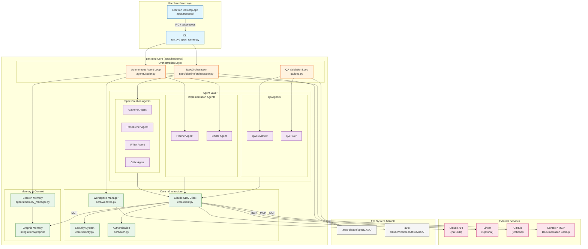
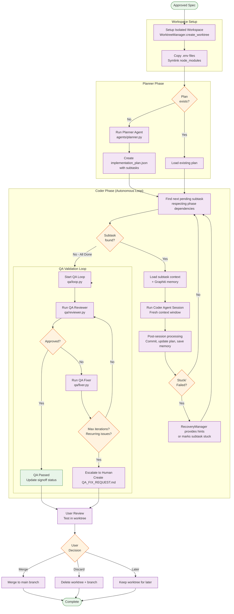

# Auto Claude Architecture Overview

This document provides a comprehensive technical overview of Auto Claude's architecture, including its agent system, pipelines, security model, and integrations.

> **Related Documentation:**
> - [CLAUDE.md](../CLAUDE.md) - Development guidance and quick reference
> - [CLI-USAGE.md](CLI-USAGE.md) - Terminal-only usage guide
> - [CONTRIBUTING.md](../CONTRIBUTING.md) - How to contribute

---

## Table of Contents

1. [Introduction](#introduction)
2. [System Overview](#system-overview)
3. [High-Level Architecture](#high-level-architecture)
4. [Spec Creation Pipeline](#spec-creation-pipeline)
5. [Implementation Pipeline](#implementation-pipeline)
6. [Agent System](#agent-system)
7. [Security Model](#security-model)
8. [Workspace Isolation](#workspace-isolation)
9. [Frontend-Backend Communication](#frontend-backend-communication)
10. [Integrations](#integrations)
11. [Data Flow and File Structure](#data-flow-and-file-structure)

---

## Introduction

Auto Claude is a **multi-agent autonomous coding framework** that builds software through coordinated AI agent sessions. Rather than using a single AI conversation to write code, Auto Claude orchestrates multiple specialized agents in a structured pipeline—from understanding requirements to writing code to validating the result.

### What Makes Auto Claude Different

Traditional AI coding assistants work in a single conversation where context accumulates and can be lost. Auto Claude takes a fundamentally different approach:

| Traditional AI Coding | Auto Claude |
|----------------------|-------------|
| Single conversation | Multi-session pipeline |
| Context accumulates | Fresh context per session |
| Manual task tracking | Automatic subtask management |
| No persistent memory | Cross-session memory via knowledge graph |
| Trust the output | Automated QA validation loop |
| Direct file changes | Isolated workspace (git worktrees) |

### Core Principles

1. **Structured Pipelines** - Tasks flow through well-defined phases: spec creation → planning → implementation → QA validation
2. **Fresh Context Windows** - Each agent session starts fresh, loading state from files rather than accumulating context
3. **Subtask-Based Work** - Large features are broken into atomic subtasks with individual verification
4. **Isolated Workspaces** - AI-generated code lives in git worktrees until explicitly merged by the user
5. **Defense in Depth** - Three-layer security model protects against unintended actions
6. **Cross-Session Memory** - Knowledge graph persists patterns, gotchas, and discoveries across sessions

### Primary Use Cases

- **Feature Development** - Transform a task description into implemented, tested code
- **Code Maintenance** - Handle bug fixes, refactoring, and code cleanup
- **GitHub Automation** - Automated PR reviews, issue triage, and auto-fixing
- **Documentation** - Generate and update documentation from code analysis

---

## System Overview

Auto Claude consists of two main components: a **Python backend** that orchestrates AI agents and manages the build process, and an optional **Electron desktop frontend** that provides a graphical interface for project management.

### Component Architecture

```
┌─────────────────────────────────────────────────────────────────────────┐
│                         Auto Claude System                              │
├─────────────────────────────────────────────────────────────────────────┤
│                                                                         │
│  ┌─────────────────────────────────┐    ┌─────────────────────────────┐ │
│  │       Electron Frontend         │    │       Python Backend        │ │
│  │  (Optional Desktop UI)          │    │   (Required - CLI/Agent)    │ │
│  │                                 │    │                             │ │
│  │  ┌───────────────────────────┐  │    │  ┌───────────────────────┐  │ │
│  │  │ React + TypeScript        │  │    │  │ Spec Creation         │  │ │
│  │  │ • Project Management      │  │    │  │ Pipeline              │  │ │
│  │  │ • Task Visualization      │  │◄──►│  │ (3-8 phases)          │  │ │
│  │  │ • Terminal Integration    │  │IPC │  └───────────────────────┘  │ │
│  │  └───────────────────────────┘  │    │                             │ │
│  │                                 │    │  ┌───────────────────────┐  │ │
│  │  ┌───────────────────────────┐  │    │  │ Implementation        │  │ │
│  │  │ Main Process (Node.js)    │  │    │  │ Pipeline              │  │ │
│  │  │ • Agent Process Manager   │  │───►│  │ (Planner→Coder→QA)    │  │ │
│  │  │ • PTY Terminal Manager    │  │    │  └───────────────────────┘  │ │
│  │  │ • IPC Handlers            │  │    │                             │ │
│  │  └───────────────────────────┘  │    │  ┌───────────────────────┐  │ │
│  │                                 │    │  │ Claude Agent SDK      │  │ │
│  └─────────────────────────────────┘    │  │ • Security Hooks      │  │ │
│                                         │  │ • MCP Servers         │  │ │
│                                         │  │ • Tool Permissions    │  │ │
│                                         │  └───────────────────────┘  │ │
│                                         │                             │ │
│                                         └─────────────────────────────┘ │
│                                                                         │
├─────────────────────────────────────────────────────────────────────────┤
│                           External Services                             │
│  ┌──────────────┐ ┌──────────────┐ ┌──────────────┐ ┌───────────────┐  │
│  │ Claude API   │ │ Graphiti     │ │ Linear       │ │ GitHub        │  │
│  │ (via SDK)    │ │ Memory       │ │ (optional)   │ │ (optional)    │  │
│  └──────────────┘ └──────────────┘ └──────────────┘ └───────────────┘  │
└─────────────────────────────────────────────────────────────────────────┘
```

### Backend Architecture (`apps/backend/`)

The Python backend is the core of Auto Claude. It can run standalone via CLI or be orchestrated by the Electron frontend.

| Directory | Purpose |
|-----------|---------|
| `core/` | Client factory, authentication, security, platform abstraction |
| `agents/` | Implementation agents (planner, coder, session management) |
| `qa/` | QA validation agents (reviewer, fixer, loop orchestration) |
| `spec/` | Spec creation pipeline (phases, orchestrator, discovery) |
| `spec_agents/` | Spec creation agents (gatherer, researcher, writer, critic) |
| `cli/` | Command-line interface and command handlers |
| `integrations/` | External service integrations (Graphiti, Linear, GitHub) |
| `prompts/` | Agent system prompts (markdown files) |
| `project/` | Project analysis for security profile generation |
| `security/` | Command validation and security hooks |

### Frontend Architecture (`apps/frontend/`)

The Electron desktop app provides a visual interface for managing projects and tasks.

| Directory | Purpose |
|-----------|---------|
| `src/main/` | Electron main process, IPC handlers, process managers |
| `src/renderer/` | React components, Zustand stores, hooks |
| `src/preload/` | Secure bridge between main and renderer processes |
| `src/shared/` | TypeScript types, i18n translations, constants |

### Key Technology Choices

| Component | Technology | Rationale |
|-----------|------------|-----------|
| AI Integration | Claude Agent SDK | Pre-configured security, MCP support, session management |
| Backend Runtime | Python 3.12+ | Rich AI/ML ecosystem, async support, cross-platform |
| Frontend Runtime | Electron + React | Desktop-class features, cross-platform, rich UI |
| State Management | Zustand (frontend) | Lightweight, TypeScript-first, no boilerplate |
| Memory System | Graphiti + LadybugDB | Knowledge graph for semantic search, no Docker required |
| Workspace Isolation | Git Worktrees | Native git feature, clean separation, easy cleanup |
| Process Communication | IPC (Electron) | Type-safe, bidirectional, secure context isolation |

### Operational Modes

Auto Claude can operate in several modes:

1. **CLI Mode** - Direct command-line usage without the desktop app
   ```bash
   python run.py --spec 001  # Run a spec
   python spec_runner.py --task "Add login feature"  # Create a spec
   ```

2. **Desktop Mode** - Full GUI experience via Electron
   ```bash
   npm start  # Launch desktop app
   ```

3. **GitHub Runner Mode** - Automated PR review and issue triage
   ```bash
   python run.py --pr 123 --review  # Review a PR
   python run.py --issue 456 --auto-fix  # Auto-fix an issue
   ```

### Data Flow Summary

```
User Task Description
        │
        ▼
┌───────────────────┐
│ Spec Creation     │ ──► requirements.json, context.json, spec.md
│ Pipeline          │
└───────────────────┘
        │
        ▼
┌───────────────────┐
│ Planner Agent     │ ──► implementation_plan.json
└───────────────────┘
        │
        ▼
┌───────────────────┐
│ Coder Agent       │ ──► Code changes in isolated worktree
│ (multiple sessions)│
└───────────────────┘
        │
        ▼
┌───────────────────┐
│ QA Validation     │ ──► qa_report.md, QA_FIX_REQUEST.md
│ Loop              │
└───────────────────┘
        │
        ▼
User Review & Merge
```

This overview sets the foundation for understanding the detailed architecture sections that follow. Each subsequent section dives deep into specific components, their interactions, and the design decisions behind them.

---

## High-Level Architecture

This section provides a detailed view of Auto Claude's architectural components and their relationships.

### System Component Diagram



### Component Responsibilities

#### Entry Points

| Entry Point | Location | Purpose |
|-------------|----------|---------|
| `run.py` | `apps/backend/run.py` | Bootstrap entry for CLI - validates Python version, configures encoding, delegates to `cli/main.py` |
| `spec_runner.py` | `apps/backend/spec_runner.py` | Interactive spec creation - can be invoked directly or chains to `run.py` |
| Electron Main | `apps/frontend/src/main/` | Desktop app entry - manages windows, spawns backend processes |

#### Orchestration Layer

The orchestration layer coordinates agent execution through well-defined pipelines:

| Orchestrator | Location | Role |
|--------------|----------|------|
| **SpecOrchestrator** | `spec/pipeline/orchestrator.py` | Drives spec creation through complexity-dependent phases (3-8 phases) |
| **Autonomous Agent Loop** | `agents/coder.py` | Executes Planner → Coder sessions iteratively until all subtasks complete |
| **QA Validation Loop** | `qa/loop.py` | Runs QA Reviewer → QA Fixer cycle until approval or escalation |

#### Agent Layer

Agents are the AI-powered workers that perform actual tasks. Each agent type has specific capabilities and tool access:

```
┌─────────────────────────────────────────────────────────────────┐
│                        SPEC CREATION AGENTS                      │
├────────────────┬───────────────────────────────────────────────-─┤
│ Gatherer       │ Collects user requirements, asks clarifying     │
│                │ questions, outputs requirements.json             │
├────────────────┼────────────────────────────────────────────────-┤
│ Researcher     │ Validates external integrations, checks API     │
│                │ compatibility, outputs research.json             │
├────────────────┼────────────────────────────────────────────────-┤
│ Writer         │ Creates spec.md from requirements and context   │
├────────────────┼────────────────────────────────────────────────-┤
│ Critic         │ Self-critique using extended thinking,          │
│                │ improves spec quality                            │
└────────────────┴────────────────────────────────────────────────-┘

┌─────────────────────────────────────────────────────────────────┐
│                      IMPLEMENTATION AGENTS                       │
├────────────────┬────────────────────────────────────────────────-┤
│ Planner        │ Analyzes spec, creates implementation_plan.json │
│                │ with subtasks, verification strategies          │
├────────────────┼────────────────────────────────────────────────-┤
│ Coder          │ Implements subtasks one-by-one, commits code,   │
│                │ updates plan status                              │
└────────────────┴────────────────────────────────────────────────-┘

┌─────────────────────────────────────────────────────────────────┐
│                          QA AGENTS                               │
├────────────────┬────────────────────────────────────────────────-┤
│ QA Reviewer    │ Validates implementation against acceptance     │
│                │ criteria, runs tests, checks security           │
├────────────────┼────────────────────────────────────────────────-┤
│ QA Fixer       │ Fixes issues identified by reviewer, minimal    │
│                │ changes approach                                 │
└────────────────┴────────────────────────────────────────────────-┘
```

#### Core Infrastructure

The core layer provides foundational services used by all agents:

| Component | Location | Responsibility |
|-----------|----------|----------------|
| **Claude SDK Client** | `core/client.py` | Factory for configured `ClaudeSDKClient` with security hooks, MCP servers, and tool permissions |
| **Authentication** | `core/auth.py` | OAuth token resolution from env vars, keychains; SDK environment passthrough |
| **Security System** | `core/security.py` + `security/` | Three-layer defense: sandbox, filesystem permissions, command allowlist |
| **Project Analyzer** | `project/analyzer.py` | Detects tech stack, generates dynamic command allowlist |
| **Workspace Manager** | `core/worktree.py` | Git worktree lifecycle: create, sync, merge, cleanup |

#### Memory System

Memory enables cross-session learning and context persistence:

| Component | Location | Function |
|-----------|----------|----------|
| **Graphiti Memory** | `integrations/graphiti/` | Knowledge graph with semantic search, stores patterns/gotchas/discoveries |
| **Session Memory** | `agents/memory_manager.py` | Orchestrates memory retrieval at session start, saves insights at session end |
| **File-Based Fallback** | `session_memory.json` | Lightweight JSON fallback when Graphiti is unavailable |

### Layered Architecture View

Auto Claude follows a layered architecture where each layer has clear responsibilities and dependencies flow downward:

```
┌─────────────────────────────────────────────────────────────────────┐
│ PRESENTATION LAYER                                                   │
│   CLI (argparse) │ Electron IPC │ Web API (future)                  │
├─────────────────────────────────────────────────────────────────────┤
│ ORCHESTRATION LAYER                                                  │
│   SpecOrchestrator │ AutonomousAgentLoop │ QAValidationLoop         │
├─────────────────────────────────────────────────────────────────────┤
│ AGENT LAYER                                                          │
│   Spec Agents │ Implementation Agents │ QA Agents                   │
│   (Each agent = system prompt + tool permissions + MCP access)      │
├─────────────────────────────────────────────────────────────────────┤
│ CORE SERVICES LAYER                                                  │
│   ClaudeSDKClient │ SecurityProfile │ WorktreeManager │ Memory      │
├─────────────────────────────────────────────────────────────────────┤
│ INFRASTRUCTURE LAYER                                                 │
│   Claude API │ Git │ File System │ External APIs (Linear, GitHub)  │
└─────────────────────────────────────────────────────────────────────┘
```

### Key Architectural Patterns

#### 1. Fresh Context Window Pattern

Each agent session starts with a fresh context window. State is loaded from files (spec, plan, previous outputs) rather than accumulated from conversation history:

```python
# agents/coder.py - Each session loads state fresh
def run_autonomous_agent():
    # Load plan from file (not from memory)
    plan = load_implementation_plan(spec_dir)

    # Find next subtask to work on
    subtask = get_next_pending_subtask(plan)

    # Generate prompt with all needed context
    prompt = generate_subtask_prompt(subtask, spec_dir)

    # Run session with fresh context
    client.create_agent_session(starting_message=prompt)
```

**Why?** AI context windows have limits. Long conversations degrade performance. Fresh sessions maintain quality.

#### 2. Subtask-Based Execution

Large features are decomposed into atomic subtasks, each with:
- Clear description
- Files to modify
- Verification strategy
- Status tracking (pending → in_progress → completed)

```json
{
  "id": "subtask-2-1",
  "description": "Add authentication middleware",
  "files": ["src/middleware/auth.ts"],
  "verification": "npm test -- auth.test.ts",
  "status": "pending"
}
```

**Why?** Atomic units are easier for AI to implement correctly. Failed subtasks can be retried without losing progress.

#### 3. Phase-Aware Tool Configuration

Different agents get different tool access based on their role:

| Agent Type | Tools | MCP Servers |
|------------|-------|-------------|
| Spec Gatherer | Read + Web | — |
| Spec Researcher | Read + Web | context7 |
| Planner | Read + Write + Web | context7, graphiti, auto-claude |
| Coder | Read + Write + Web | context7, graphiti, auto-claude |
| QA Reviewer | Read + Write + Web | context7, graphiti, auto-claude, browser |
| QA Fixer | Read + Write + Web | context7, graphiti, auto-claude, browser |

**Why?** Least privilege principle. Spec gathering agents don't need write access. Only QA agents need browser automation.

#### 4. Isolation-First Workspace

By default, all AI-generated code is written to an isolated git worktree:

```
project/
├── .auto-claude/
│   ├── specs/001-feature/       # Spec artifacts
│   └── worktrees/tasks/001-feature/  # Isolated workspace (git worktree)
├── src/                         # User's code (untouched)
└── ...
```

**Why?** Users can review, test, and reject AI changes without affecting their working directory.

#### 5. Recovery and Resilience

The system includes multiple recovery mechanisms:

| Mechanism | Purpose |
|-----------|---------|
| **RecoveryManager** | Tracks failed subtask attempts, provides hints, marks stuck tasks |
| **Consecutive Error Escalation** | After 3 consecutive errors in QA loop, escalates to human |
| **Recurring Issue Detection** | After 3 occurrences of same issue, escalates to human |
| **Human Intervention File** | `PAUSE` file in spec dir halts automation for manual intervention |

### Request Flow Example

Here's how a typical feature request flows through the architecture:

```
1. User: "Add user authentication with JWT"
                    │
                    ▼
2. CLI parses command, invokes SpecOrchestrator
                    │
                    ▼
3. SpecOrchestrator runs complexity assessment
   └── Determines: STANDARD complexity (6 phases)
                    │
                    ▼
4. Spec Creation Pipeline:
   ├── Discovery Phase → project_index.json
   ├── Requirements Phase → requirements.json (via Gatherer Agent)
   ├── Context Phase → context.json
   ├── Spec Writing Phase → spec.md (via Writer Agent)
   └── Planning Phase → implementation_plan.json (via Planner Agent)
                    │
                    ▼
5. Autonomous Agent Loop starts:
   └── For each subtask:
       ├── Load subtask context
       ├── Retrieve Graphiti memory
       ├── Run Coder Agent session
       ├── Post-session: commit, update plan, save memory
       └── Continue to next subtask
                    │
                    ▼
6. QA Validation Loop:
   ├── Run QA Reviewer
   ├── If rejected: Run QA Fixer → Loop back
   └── If approved: Complete
                    │
                    ▼
7. User Review:
   ├── Test in isolated worktree
   ├── Approve → Merge to main
   └── Reject → Discard worktree
```

---

## Spec Creation Pipeline

The Spec Creation Pipeline transforms a user's task description into a comprehensive specification document with an implementation plan. It dynamically adapts its workflow based on task complexity—simple tasks flow through a streamlined 4-phase pipeline while complex tasks go through up to 9 phases including research and self-critique.

### Pipeline Overview

The pipeline is orchestrated by the `SpecOrchestrator` class (`spec/pipeline/orchestrator.py`), which:

1. **Assesses Complexity** - Uses AI or heuristics to determine task scope
2. **Selects Phases** - Chooses which phases to run based on complexity
3. **Executes Phases** - Runs phases sequentially with retry logic
4. **Compacts Context** - Summarizes completed phases to manage context window
5. **Validates Output** - Ensures all required artifacts are created

### Complexity Tiers

Auto Claude uses three complexity tiers to optimize the spec creation process:

| Tier | Files | Services | Integrations | Example Tasks |
|------|-------|----------|--------------|---------------|
| **SIMPLE** | 1-2 | 1 | None | Fix typo, update button text, change colors |
| **STANDARD** | 3-10 | 1-2 | 0-1 | Add a feature, create new component, refactor module |
| **COMPLEX** | 10+ | 3+ | 2+ | Add authentication, integrate payment system, multi-service refactor |

#### Complexity Assessment

Complexity can be determined three ways:

1. **AI Assessment** (default) - Runs `complexity_assessor.md` prompt to analyze requirements
2. **Heuristic Analysis** - Keyword matching and pattern detection (fallback)
3. **Manual Override** - User specifies `--complexity simple/standard/complex`

```python
# spec/complexity.py - ComplexityAnalyzer keywords
SIMPLE_KEYWORDS = ["fix", "typo", "update", "change", "rename", "style", "color", "text"]
COMPLEX_KEYWORDS = ["integrate", "api", "database", "migrate", "authentication", "oauth"]
```

### Phase Definitions

Each complexity tier runs a different set of phases:

```
SIMPLE (4 phases):
  discovery → historical_context → quick_spec → validation

STANDARD (7 phases):
  discovery → requirements → historical_context → [research] → context → spec_writing → planning → validation

COMPLEX (9 phases):
  discovery → requirements → historical_context → research → context → spec_writing → self_critique → planning → validation
```

#### Phase Details

| Phase | Agent/Script | Output File | Purpose |
|-------|--------------|-------------|---------|
| **discovery** | `analyze_project()` | `project_index.json` | Scan project structure, detect tech stack, identify capabilities |
| **requirements** | Interactive / `spec_gatherer.md` | `requirements.json` | Collect task description, acceptance criteria, constraints |
| **complexity_assessment** | `complexity_assessor.md` | `complexity_assessment.json` | Analyze task scope, determine phases to run |
| **historical_context** | Graphiti query | `graph_hints.json` | Retrieve relevant patterns and gotchas from past sessions |
| **research** | `spec_researcher.md` | `research.json` | Validate external integrations, check API compatibility |
| **context** | File analysis | `context.json` | Identify relevant files, existing patterns, dependencies |
| **spec_writing** | `spec_writer.md` | `spec.md` | Create detailed feature specification document |
| **self_critique** | `spec_critic.md` | Updates `spec.md` | Review and improve spec using extended thinking |
| **quick_spec** | `spec_quick.md` | `spec.md` + `implementation_plan.json` | Combined spec+plan for simple tasks |
| **planning** | `planner.md` | `implementation_plan.json` | Create subtask-based implementation plan |
| **validation** | `SpecValidator` | — | Verify all required files exist with valid structure |

### Spec Creation Flow Diagram


### Spec Creation Agents

The pipeline uses specialized agents for different phases:

#### Gatherer Agent (`spec_gatherer.md`)

**Purpose:** Interactively collects requirements from the user.

**Capabilities:**
- Asks clarifying questions about scope
- Identifies services and components involved
- Extracts acceptance criteria
- Detects constraints and blockers

**Output:** `requirements.json` with structured task information

#### Researcher Agent (`spec_researcher.md`)

**Purpose:** Validates external integrations and researches best practices.

**Capabilities:**
- Verifies package names and versions
- Checks API compatibility
- Identifies known issues or gotchas
- Uses Context7 MCP for documentation lookup

**Output:** `research.json` with validated integration details

#### Writer Agent (`spec_writer.md`)

**Purpose:** Creates the comprehensive specification document.

**Capabilities:**
- Synthesizes requirements, research, and context
- Defines technical approach
- Documents API contracts
- Lists all files to modify

**Output:** `spec.md` with complete feature specification

#### Critic Agent (`spec_critic.md`)

**Purpose:** Self-reviews the spec using extended thinking (ultrathink mode).

**Capabilities:**
- Identifies gaps and inconsistencies
- Suggests improvements to technical approach
- Validates acceptance criteria completeness
- Ensures implementation feasibility

**Output:** Updated `spec.md` with improvements

#### Quick Spec Agent (`spec_quick.md`)

**Purpose:** Combined spec and plan creation for simple tasks.

**Capabilities:**
- Creates streamlined spec for small changes
- Generates implementation plan simultaneously
- Skips unnecessary phases for efficiency

**Output:** `spec.md` + `implementation_plan.json`

### Phase Execution Architecture

The `PhaseExecutor` class (`spec/phases/executor.py`) combines multiple mixins to implement all phases:

```
PhaseExecutor
├── DiscoveryPhaseMixin      # phase_discovery, phase_context
├── RequirementsPhaseMixin   # phase_requirements, phase_historical_context, phase_research
├── SpecPhaseMixin           # phase_spec_writing, phase_self_critique, phase_quick_spec
└── PlanningPhaseMixin       # phase_planning, phase_validation
```

Each phase:
1. **Checks for existing output** - Idempotency (skip if file exists)
2. **Runs agent/script** - Up to 3 retry attempts
3. **Validates output** - Ensures file was created with valid structure
4. **Stores summary** - Compacts output for subsequent phases (context window management)

### Phase Compaction

To manage context window size, completed phases are summarized:

```python
# spec/compaction.py
async def summarize_phase_output(phase_name: str, output: str, target_words: int = 500) -> str:
    """Summarize phase output to fit in context window."""
    # Uses a small, fast model to create concise summaries
    # Summaries are passed to subsequent phases as prior_phase_summaries
```

This allows the full pipeline to run without exhausting the context window, even for complex tasks with lengthy outputs.

### Output Files Summary

After spec creation completes, the spec directory contains:

```
.auto-claude/specs/001-add-auth/
├── requirements.json          # User requirements and acceptance criteria
├── complexity_assessment.json # Complexity tier and reasoning
├── graph_hints.json          # Historical context from Graphiti (if enabled)
├── research.json             # External integration research (if needed)
├── context.json              # Relevant files and patterns
├── spec.md                   # Complete feature specification
└── implementation_plan.json  # Subtask-based plan (ready for build)
```

### Human Review Checkpoint

After all phases complete, the pipeline pauses for human review:

1. **Display Summary** - Shows complexity, phases run, files created
2. **Review Options** - User can approve, edit spec, or abort
3. **Validation** - Checks that all required files exist
4. **Approval Required** - Build cannot proceed without explicit approval

This checkpoint ensures the AI's understanding matches user intent before committing significant resources to implementation.

---

## Implementation Pipeline

Once a spec is created and approved, the Implementation Pipeline takes over. This pipeline transforms the specification into working code through a coordinated sequence of autonomous agent sessions—from planning the work to implementing subtasks to validating the result.

### Pipeline Overview

The Implementation Pipeline consists of three main phases:

```
┌─────────────────────────────────────────────────────────────────────────────┐
│                        IMPLEMENTATION PIPELINE                               │
├─────────────────────────────────────────────────────────────────────────────┤
│                                                                              │
│  ┌────────────────┐     ┌─────────────────────┐     ┌──────────────────┐   │
│  │   PLANNER      │     │      CODER          │     │   QA LOOP        │   │
│  │   PHASE        │────►│      PHASE          │────►│   PHASE          │   │
│  │                │     │  (multiple sessions) │     │  (review/fix)    │   │
│  │  Create plan   │     │  Implement subtasks  │     │  Validate work   │   │
│  └────────────────┘     └─────────────────────┘     └──────────────────┘   │
│         │                        │                          │               │
│         ▼                        ▼                          ▼               │
│  implementation_plan.json   Code changes            qa_report.md           │
│                             in worktree             QA signoff             │
│                                                                              │
└─────────────────────────────────────────────────────────────────────────────┘
```

| Phase | Agent | Entry Point | Outputs |
|-------|-------|-------------|---------|
| **Planning** | Planner Agent | `agents/planner.py` | `implementation_plan.json` with subtasks |
| **Implementation** | Coder Agent | `agents/coder.py` | Code changes, commits, plan status updates |
| **Validation** | QA Reviewer + Fixer | `qa/loop.py` | `qa_report.md`, QA signoff in plan |

### Implementation Flow Diagram



### Planner Agent

The Planner Agent analyzes the spec and creates a detailed implementation plan with phased subtasks.

#### Purpose

- Understand the full scope of the feature
- Identify dependencies between tasks
- Create atomic, verifiable subtasks
- Establish verification strategies for each subtask

#### Planner Flow

```python
# agents/planner.py - Simplified flow
async def run_planner_session(spec_dir: Path, project_dir: Path):
    # 1. Load planner prompt and spec context
    prompt = load_prompt("planner.md")
    spec = load_spec(spec_dir)

    # 2. Create Claude SDK client with planner permissions
    client = create_client(
        agent_type="planner",
        project_dir=project_dir,
        spec_dir=spec_dir
    )

    # 3. Run single planning session
    response = await client.create_agent_session(
        starting_message=f"Create implementation plan for:\n{spec}"
    )

    # 4. Validate plan has pending subtasks
    plan = load_implementation_plan(spec_dir)
    if not has_pending_subtasks(plan):
        raise PlanningError("Plan has no pending subtasks")
```

#### Plan Structure

The planner creates `implementation_plan.json` with this structure:

```json
{
  "feature": "User Authentication",
  "description": "Add JWT-based authentication with login/logout",
  "phases": [
    {
      "phase": 1,
      "name": "Backend Authentication",
      "description": "Implement auth middleware and endpoints",
      "subtasks": [
        {
          "id": "subtask-1-1",
          "description": "Create JWT token utilities",
          "files": ["src/utils/jwt.ts"],
          "verification": "npm test -- jwt.test.ts",
          "status": "pending"
        },
        {
          "id": "subtask-1-2",
          "description": "Implement auth middleware",
          "files": ["src/middleware/auth.ts"],
          "verification": "npm test -- auth.test.ts",
          "status": "pending",
          "depends_on": ["subtask-1-1"]
        }
      ]
    },
    {
      "phase": 2,
      "name": "Frontend Integration",
      "description": "Add login UI and state management",
      "subtasks": [...]
    }
  ],
  "qa_signoff": null,
  "status": "pending"
}
```

#### Key Planning Features

| Feature | Description |
|---------|-------------|
| **Phased Subtasks** | Subtasks are grouped into phases; all Phase 1 subtasks must complete before Phase 2 starts |
| **Dependencies** | Subtasks can declare `depends_on` to enforce ordering within a phase |
| **Verification Strategies** | Each subtask includes a command or description for verification |
| **File Tracking** | Lists files to modify, helping prevent conflicts |
| **Status Tracking** | `pending` → `in_progress` → `completed` (or `stuck`) |

### Coder Agent

The Coder Agent is the workhorse of the Implementation Pipeline. It runs in an autonomous loop, implementing subtasks one at a time until all work is complete.

#### Autonomous Loop Architecture

```
┌─────────────────────────────────────────────────────────────────────────────┐
│                        AUTONOMOUS AGENT LOOP                                 │
│                        (agents/coder.py)                                    │
├─────────────────────────────────────────────────────────────────────────────┤
│                                                                              │
│  ┌──────────────────────────────────────────────────────────────────────┐   │
│  │  FOR EACH SESSION:                                                    │   │
│  │                                                                       │   │
│  │  1. Load implementation_plan.json                                    │   │
│  │  2. Find next pending subtask (respects phase order + dependencies)   │   │
│  │  3. Generate subtask-specific prompt with:                           │   │
│  │     - Subtask description                                            │   │
│  │     - Files to modify                                                │   │
│  │     - Verification strategy                                          │   │
│  │     - Recovery hints (if retry)                                      │   │
│  │  4. Retrieve Graphiti memory context                                 │   │
│  │  5. Run Coder Agent session (fresh context window)                   │   │
│  │  6. Post-session processing:                                         │   │
│  │     - Auto-commit changes                                            │   │
│  │     - Update subtask status in plan                                  │   │
│  │     - Save discoveries/patterns to Graphiti                          │   │
│  │     - Sync worktree if isolated mode                                 │   │
│  │  7. Check for stuck/failed subtasks                                  │   │
│  │  8. Wait AUTO_CONTINUE_DELAY_SECONDS (3s)                            │   │
│  │  9. Loop to next subtask                                             │   │
│  │                                                                       │   │
│  └──────────────────────────────────────────────────────────────────────┘   │
│                                                                              │
│  EXIT CONDITIONS:                                                            │
│  • All subtasks completed                                                   │
│  • PAUSE file detected (human intervention requested)                       │
│  • Max consecutive failures reached                                         │
│                                                                              │
└─────────────────────────────────────────────────────────────────────────────┘
```

#### Key Coder Features

| Feature | Implementation | Purpose |
|---------|----------------|---------|
| **Fresh Context Window** | Each session loads state from files | Prevents context degradation over long conversations |
| **Subtask Isolation** | One subtask per session | Focused work, clear verification |
| **Recovery System** | `RecoveryManager` class | Tracks failures, provides hints, marks stuck |
| **Memory Integration** | Graphiti queries at session start | Applies patterns and avoids past gotchas |
| **Auto-Continue** | 3-second delay between sessions | Allows human intervention via PAUSE file |
| **Worktree Sync** | Syncs changes to isolated worktree | Keeps work separate from user's directory |

#### Subtask Selection Algorithm

The coder selects the next subtask using this priority:

```python
# Simplified subtask selection logic
def get_next_pending_subtask(plan):
    for phase in plan["phases"]:
        # Only work on current phase (earlier phases must be done)
        if not all_subtasks_complete(phase):
            for subtask in phase["subtasks"]:
                if subtask["status"] == "pending":
                    # Check dependencies within phase
                    if dependencies_satisfied(subtask, phase):
                        return subtask
            # If pending subtasks exist but dependencies not met, wait
            return None
    return None  # All phases complete
```

#### Session Prompt Generation

Each coder session receives a tailored prompt:

```python
# agents/coder.py - Prompt generation
def generate_subtask_prompt(subtask, spec_dir, recovery_hints=None):
    prompt = f"""
## Current Subtask

**ID:** {subtask['id']}
**Description:** {subtask['description']}
**Files to modify:** {', '.join(subtask.get('files', []))}
**Verification:** {subtask.get('verification', 'Manual verification')}

## Spec Context
{load_file(spec_dir / 'spec.md')}

## Implementation Plan
{load_file(spec_dir / 'implementation_plan.json')}
"""
    if recovery_hints:
        prompt += f"\n## Recovery Hints\n{recovery_hints}"

    return prompt
```

#### Recovery System

The `RecoveryManager` handles subtask failures:

```
┌──────────────────────────────────────────────────────────────────────┐
│                      RECOVERY SYSTEM                                  │
├──────────────────────────────────────────────────────────────────────┤
│                                                                       │
│  Attempt 1: Normal execution                                         │
│       ↓ FAIL                                                         │
│  Attempt 2: Retry with error context                                 │
│       ↓ FAIL                                                         │
│  Attempt 3: Retry with expanded hints                                │
│       ↓ FAIL                                                         │
│  Mark subtask as "stuck" → Human intervention required               │
│                                                                       │
│  Recovery hints include:                                             │
│  • Previous error messages                                           │
│  • Files that were modified                                          │
│  • Suggested alternative approaches                                  │
│  • Relevant Graphiti gotchas                                         │
│                                                                       │
└──────────────────────────────────────────────────────────────────────┘
```

#### Post-Session Processing

After each coder session completes:

```python
# agents/session.py - Post-session processing
async def post_session_processing(spec_dir, subtask_id, session_result):
    # 1. Auto-commit any changes
    if has_uncommitted_changes():
        commit_changes(f"auto-claude: {subtask_id}")

    # 2. Update subtask status in implementation_plan.json
    update_subtask_status(spec_dir, subtask_id, "completed")

    # 3. Save session insights to Graphiti memory
    if graphiti_enabled():
        save_session_memory(
            patterns=extract_patterns(session_result),
            discoveries=extract_discoveries(session_result),
            gotchas=extract_gotchas(session_result)
        )

    # 4. Update build-progress.txt
    update_build_progress(spec_dir, subtask_id)

    # 5. Sync to worktree if in isolated mode
    if workspace_mode == ISOLATED:
        sync_worktree_changes()
```

### QA Validation Loop

The QA Validation Loop ensures the implemented code meets acceptance criteria before declaring the build complete.

#### Loop Architecture

```
┌─────────────────────────────────────────────────────────────────────────────┐
│                        QA VALIDATION LOOP                                    │
│                        (qa/loop.py)                                         │
├─────────────────────────────────────────────────────────────────────────────┤
│                                                                              │
│  Constants:                                                                 │
│  • MAX_QA_ITERATIONS = 50                                                   │
│  • RECURRING_ISSUE_THRESHOLD = 3                                            │
│  • MAX_CONSECUTIVE_ERRORS = 3                                               │
│                                                                              │
│  ┌─────────────────────────────────────────────────────────────────────┐    │
│  │  LOOP:                                                               │    │
│  │                                                                      │    │
│  │  1. Check for human feedback (QA_FIX_REQUEST.md from user)          │    │
│  │  2. Run QA Reviewer session                                         │    │
│  │     └── Validates against acceptance criteria                       │    │
│  │     └── Runs tests, checks security, browser verification           │    │
│  │     └── Sets qa_signoff in implementation_plan.json                 │    │
│  │                                                                      │    │
│  │  3. Check signoff status:                                           │    │
│  │     └── APPROVED → Exit loop (success)                              │    │
│  │     └── REJECTED → Continue to step 4                               │    │
│  │                                                                      │    │
│  │  4. Detect recurring issues                                         │    │
│  │     └── If same issue appears 3+ times → Escalate to human         │    │
│  │                                                                      │    │
│  │  5. Run QA Fixer session                                            │    │
│  │     └── Reads QA_FIX_REQUEST.md for specific issues                │    │
│  │     └── Makes minimal fixes                                         │    │
│  │     └── Commits changes                                             │    │
│  │                                                                      │    │
│  │  6. Increment iteration counter                                     │    │
│  │     └── If max iterations reached → Escalate to human              │    │
│  │                                                                      │    │
│  │  7. Loop back to step 1                                             │    │
│  │                                                                      │    │
│  └─────────────────────────────────────────────────────────────────────┘    │
│                                                                              │
└─────────────────────────────────────────────────────────────────────────────┘
```

#### QA Reviewer Agent

The QA Reviewer validates the implementation against the spec's acceptance criteria.

**Capabilities:**
| Capability | Description |
|------------|-------------|
| **Test Execution** | Runs project test suites (npm test, pytest, etc.) |
| **Browser Verification** | Uses Electron MCP or Puppeteer for UI testing |
| **Security Review** | Checks for common vulnerabilities, secret exposure |
| **Code Quality** | Validates patterns, error handling, edge cases |
| **Memory Context** | Applies past QA patterns from Graphiti |

**Validation Process:**
```python
# qa/reviewer.py - Simplified flow
async def run_qa_reviewer(spec_dir, project_dir):
    # 1. Load QA reviewer prompt with MCP tools
    prompt = load_prompt("qa_reviewer.md")

    # 2. Get browser tools based on project type
    if is_electron_project(project_dir):
        mcp_tools = ["electron"]  # Desktop app automation
    elif is_web_project(project_dir):
        mcp_tools = ["puppeteer"]  # Browser automation

    # 3. Create client with QA permissions
    client = create_client(
        agent_type="qa_reviewer",
        mcp_servers=["context7", "graphiti", "auto-claude"] + mcp_tools
    )

    # 4. Run validation session
    await client.create_agent_session(
        starting_message=f"Validate implementation:\n{spec}\n{plan}"
    )

    # 5. Check signoff status (set by agent via MCP tool)
    plan = load_implementation_plan(spec_dir)
    return plan.get("qa_signoff", {}).get("status")
```

**QA Signoff Structure:**
```json
{
  "qa_signoff": {
    "status": "rejected",  // or "approved"
    "issues": [
      {
        "id": "qa-issue-1",
        "severity": "high",
        "description": "Login button doesn't handle network errors",
        "location": "src/components/LoginForm.tsx:45",
        "suggestion": "Add try/catch around fetch call"
      }
    ],
    "tests_passed": ["auth.test.ts", "api.test.ts"],
    "tests_failed": ["e2e/login.spec.ts"],
    "reviewed_at": "2024-01-15T10:30:00Z"
  }
}
```

#### QA Fixer Agent

The QA Fixer addresses issues identified by the reviewer with minimal, targeted changes.

**Key Principles:**
- **Minimal Changes** - Fix only what's broken, don't refactor
- **Issue-Specific** - Addresses issues from QA_FIX_REQUEST.md
- **Verification** - Runs relevant tests after each fix
- **Commit Protocol** - Commits each fix separately for traceability

**Fix Process:**
```python
# qa/fixer.py - Simplified flow
async def run_qa_fixer(spec_dir, project_dir):
    # 1. Load fix request
    fix_request = load_file(spec_dir / "QA_FIX_REQUEST.md")

    # 2. Load QA fixer prompt
    prompt = load_prompt("qa_fixer.md")

    # 3. Retrieve past fix patterns from memory
    fix_patterns = get_graphiti_context(
        query="QA fix patterns",
        categories=["fix_pattern", "gotcha"]
    )

    # 4. Create client with fixer permissions
    client = create_client(
        agent_type="qa_fixer",
        project_dir=project_dir,
        spec_dir=spec_dir
    )

    # 5. Run fix session
    await client.create_agent_session(
        starting_message=f"""
        Fix these QA issues:
        {fix_request}

        Relevant patterns from past fixes:
        {fix_patterns}
        """
    )
```

#### Escalation to Human

When the QA loop cannot resolve issues automatically, it escalates to human intervention:

**Escalation Triggers:**
| Trigger | Threshold | Action |
|---------|-----------|--------|
| Max iterations | 50 | Create QA_FIX_REQUEST.md with full history |
| Recurring issue | Same issue 3+ times | Flag issue as needing human insight |
| Consecutive errors | 3 errors in a row | Pause loop, request human review |

**QA_FIX_REQUEST.md Format:**
```markdown
# QA Fix Request

## Build Status
- Iterations: 12
- Last reviewed: 2024-01-15T10:30:00Z

## Recurring Issues (Need Human Help)

### Issue: Network error handling in LoginForm
- First seen: Iteration 3
- Occurrences: 4
- Last suggestion: "Add try/catch around fetch call"
- Why it persists: Error boundary catches exception before handler

## Current Issues

1. **[HIGH]** Login button network error handling
   - File: src/components/LoginForm.tsx:45
   - Suggestion: Review error boundary hierarchy

2. **[MEDIUM]** Missing loading state on submit
   - File: src/components/LoginForm.tsx:23
   - Suggestion: Add isLoading state

## Suggested Actions
1. Review error handling architecture
2. Consider global error boundary refactor
```

### Pipeline Status Tracking

Throughout the pipeline, status is tracked in multiple places:

| Location | Content | Updated By |
|----------|---------|------------|
| `implementation_plan.json` | Subtask statuses, QA signoff | Agents via MCP tools |
| `build-progress.txt` | Human-readable session log | Post-session processing |
| `qa_report.md` | Detailed QA findings | QA Reviewer |
| `QA_FIX_REQUEST.md` | Issues for fixer/human | QA Loop |
| Linear (optional) | Issue status sync | Linear integration |

### Human Intervention Points

The pipeline provides several points for human intervention:

1. **PAUSE File** - Create `PAUSE` in spec directory to halt automation
2. **Worktree Review** - Test changes in isolated worktree before merge
3. **QA Feedback** - Edit `QA_FIX_REQUEST.md` to guide the fixer
4. **Manual Merge** - User explicitly approves merge to main branch

---

## Agent System

The Agent System is the heart of Auto Claude's AI capabilities. It defines how AI agents interact with the codebase through a carefully controlled set of tools and external services. This section covers the agent types, tool permissions, MCP server integration, and how the Claude Agent SDK ties everything together.

### Agent System Overview

Auto Claude uses the **Claude Agent SDK** (`claude-agent-sdk` package) for all AI interactions. The SDK provides:

- **Session Management** - Each agent runs in a controlled session with defined capabilities
- **Tool Permissions** - Fine-grained control over which tools each agent can use
- **MCP Integration** - Model Context Protocol servers for external service access
- **Security Hooks** - Pre-tool-use validation for dangerous operations
- **Extended Thinking** - Configurable token budgets for complex reasoning

```
┌─────────────────────────────────────────────────────────────────────────────┐
│                           AGENT SYSTEM ARCHITECTURE                          │
├─────────────────────────────────────────────────────────────────────────────┤
│                                                                              │
│  ┌─────────────────┐     ┌─────────────────┐     ┌─────────────────┐       │
│  │  Agent Type     │     │  AGENT_CONFIGS  │     │  Claude SDK     │       │
│  │  (e.g., coder)  │────►│  (Single Source │────►│  Client         │       │
│  │                 │     │   of Truth)     │     │                 │       │
│  └─────────────────┘     └─────────────────┘     └─────────────────┘       │
│                                   │                       │                 │
│                                   ▼                       ▼                 │
│                    ┌──────────────────────────────────────────────┐        │
│                    │              Configuration                    │        │
│                    ├──────────────────────────────────────────────┤        │
│                    │  • allowed_tools: [Read, Write, Bash, ...]   │        │
│                    │  • mcp_servers: [context7, graphiti, ...]    │        │
│                    │  • auto_claude_tools: [update_subtask, ...]  │        │
│                    │  • thinking_default: "high" / "medium" / ... │        │
│                    └──────────────────────────────────────────────┘        │
│                                                                              │
└─────────────────────────────────────────────────────────────────────────────┘
```

### Agent Types

Auto Claude defines multiple agent types, each optimized for specific tasks. All agent configurations are defined in `AGENT_CONFIGS` (`agents/tools_pkg/models.py`), the single source of truth for agent capabilities.

#### Agent Categories

| Category | Agents | Purpose |
|----------|--------|---------|
| **Spec Creation** | `spec_gatherer`, `spec_researcher`, `spec_writer`, `spec_critic`, `spec_discovery`, `spec_context`, `spec_validation`, `spec_compaction` | Create and validate specifications |
| **Build** | `planner`, `coder` | Plan and implement features |
| **QA** | `qa_reviewer`, `qa_fixer` | Validate and fix implementations |
| **Utility** | `insights`, `merge_resolver`, `commit_message` | Supporting tasks |
| **Analysis** | `analysis`, `batch_analysis`, `batch_validation` | Code analysis |
| **PR/GitHub** | `pr_reviewer`, `pr_orchestrator_parallel`, `pr_followup_parallel` | PR review workflows |
| **Product** | `roadmap_discovery`, `competitor_analysis`, `ideation` | Product planning |

#### Agent Configuration Structure

Each agent in `AGENT_CONFIGS` has these properties:

```python
AGENT_CONFIGS = {
    "agent_type": {
        "tools": [...],              # Built-in tools this agent can use
        "mcp_servers": [...],        # Required MCP servers to start
        "mcp_servers_optional": [...], # Conditional servers (e.g., Linear if enabled)
        "auto_claude_tools": [...],  # Custom Auto-Claude MCP tools
        "thinking_default": "...",   # Extended thinking level (none/low/medium/high/ultrathink)
    }
}
```

#### Key Agent Configurations

| Agent | Tools | MCP Servers | Thinking | Purpose |
|-------|-------|-------------|----------|---------|
| **spec_gatherer** | Read + Web | — | medium | Collect user requirements |
| **spec_researcher** | Read + Web | context7 | medium | Validate external integrations |
| **spec_writer** | Read + Write | — | high | Create spec.md |
| **spec_critic** | Read only | — | ultrathink | Self-critique with extended thinking |
| **planner** | Read + Write + Web | context7, graphiti, auto-claude | high | Create implementation plans |
| **coder** | Read + Write + Web | context7, graphiti, auto-claude | none | Implement subtasks |
| **qa_reviewer** | Read + Write + Web | context7, graphiti, auto-claude, browser | high | Validate implementations |
| **qa_fixer** | Read + Write + Web | context7, graphiti, auto-claude, browser | medium | Fix QA issues |

### Tool System

Tools are the actions agents can perform. Auto Claude organizes tools into categories with different access levels.

#### Tool Categories

```
┌─────────────────────────────────────────────────────────────────────────────┐
│                              TOOL HIERARCHY                                   │
├─────────────────────────────────────────────────────────────────────────────┤
│                                                                              │
│  ┌───────────────────────────────────────────────────────────────────────┐  │
│  │  BASE TOOLS (Built-in Claude Code tools)                               │  │
│  ├───────────────────────────────────────────────────────────────────────┤  │
│  │  Read Tools:  Read, Glob, Grep                                        │  │
│  │  Write Tools: Write, Edit, Bash                                       │  │
│  │  Web Tools:   WebFetch, WebSearch                                     │  │
│  └───────────────────────────────────────────────────────────────────────┘  │
│                                                                              │
│  ┌───────────────────────────────────────────────────────────────────────┐  │
│  │  MCP TOOLS (External service integrations)                             │  │
│  ├───────────────────────────────────────────────────────────────────────┤  │
│  │  Context7:  resolve-library-id, get-library-docs                      │  │
│  │  Linear:    list_issues, create_issue, update_issue, ...              │  │
│  │  Graphiti:  search_nodes, search_facts, add_episode, ...              │  │
│  │  Browser:   screenshot, click, fill, evaluate (Electron/Puppeteer)    │  │
│  └───────────────────────────────────────────────────────────────────────┘  │
│                                                                              │
│  ┌───────────────────────────────────────────────────────────────────────┐  │
│  │  AUTO-CLAUDE TOOLS (Custom build management)                           │  │
│  ├───────────────────────────────────────────────────────────────────────┤  │
│  │  update_subtask_status, get_build_progress, record_discovery,         │  │
│  │  record_gotcha, get_session_context, update_qa_status                 │  │
│  └───────────────────────────────────────────────────────────────────────┘  │
│                                                                              │
└─────────────────────────────────────────────────────────────────────────────┘
```

#### Base Tools

Built-in Claude Code tools for file operations and web access:

| Tool | Category | Description |
|------|----------|-------------|
| `Read` | Read | Read file contents |
| `Glob` | Read | Find files by pattern |
| `Grep` | Read | Search file contents with regex |
| `Write` | Write | Create or overwrite files |
| `Edit` | Write | Make targeted edits to files |
| `Bash` | Write | Execute shell commands (validated by security hooks) |
| `WebFetch` | Web | Fetch and process web page content |
| `WebSearch` | Web | Search the web for information |

#### Auto-Claude Custom Tools

Custom MCP tools for build management, exposed via the `auto-claude` MCP server:

| Tool | Used By | Description |
|------|---------|-------------|
| `update_subtask_status` | Coder, QA Fixer | Update subtask status in implementation_plan.json |
| `get_build_progress` | All build agents | Get current build progress and next subtask |
| `record_discovery` | Planner, Coder | Record codebase discoveries to session memory |
| `record_gotcha` | Coder, QA Fixer | Record gotchas/pitfalls for future sessions |
| `get_session_context` | All build agents | Retrieve context from previous sessions |
| `update_qa_status` | QA Reviewer, QA Fixer | Update QA signoff status in plan |

### MCP Server Integration

Model Context Protocol (MCP) servers provide agents with access to external services and specialized capabilities.

#### Available MCP Servers

| Server | Type | Purpose | Agents |
|--------|------|---------|--------|
| **context7** | Command | Documentation lookup via `@upstash/context7-mcp` | Researchers, Planners, Coders, QA |
| **graphiti** | HTTP | Knowledge graph memory for cross-session learning | Planners, Coders, QA |
| **linear** | HTTP | Project management integration (optional) | Build and QA agents |
| **electron** | Command | Desktop app automation via Chrome DevTools Protocol | QA agents (Electron projects) |
| **puppeteer** | Command | Web browser automation for UI testing | QA agents (Web projects) |
| **auto-claude** | Command | Custom build management tools | Build and QA agents |

#### MCP Server Configuration

MCP servers are configured in the Claude SDK client options:

```python
# core/client.py - MCP server configuration
mcp_servers = {
    "context7": {
        "command": "npx",
        "args": ["-y", "@upstash/context7-mcp"],
    },
    "graphiti-memory": {
        "type": "http",
        "url": "http://localhost:8000/mcp/",  # GRAPHITI_MCP_URL
    },
    "linear": {
        "type": "http",
        "url": "https://mcp.linear.app/mcp",
        "headers": {"Authorization": f"Bearer {linear_api_key}"},
    },
    "electron": {
        "command": "npm",
        "args": ["exec", "electron-mcp-server"],
    },
    "puppeteer": {
        "command": "npx",
        "args": ["puppeteer-mcp-server"],
    },
}
```

#### Dynamic Server Selection

MCP servers are started dynamically based on:

1. **Agent Type** - Each agent only gets servers it needs (from `AGENT_CONFIGS`)
2. **Project Capabilities** - Browser tools depend on project type (Electron vs web)
3. **Integration Status** - Linear only if `LINEAR_API_KEY` is set and project enables it
4. **Per-Project Config** - `.auto-claude/.env` can enable/disable servers

```python
# agents/tools_pkg/models.py - Dynamic server selection
def get_required_mcp_servers(
    agent_type: str,
    project_capabilities: dict | None = None,
    linear_enabled: bool = False,
    mcp_config: dict | None = None,
) -> list[str]:
    """
    Get MCP servers required for this agent type.

    Handles dynamic server selection:
    - "browser" → electron (if is_electron) or puppeteer (if is_web_frontend)
    - "linear" → only if in mcp_servers_optional AND linear_enabled is True
    - "graphiti" → only if GRAPHITI_MCP_URL is set
    """
```

#### Browser Tool Selection

QA agents get browser automation tools based on project type:

```
┌─────────────────────────────────────────────────────────────────────────────┐
│                        BROWSER TOOL SELECTION                                │
├─────────────────────────────────────────────────────────────────────────────┤
│                                                                              │
│  Project Type Detection                                                     │
│         │                                                                   │
│         ▼                                                                   │
│  ┌─────────────────┐                                                        │
│  │ is_electron?    │──Yes──► Electron MCP Server                           │
│  └────────┬────────┘         • get_electron_window_info                    │
│           │ No               • take_screenshot                             │
│           ▼                  • send_command_to_electron                    │
│  ┌─────────────────┐         • read_electron_logs                          │
│  │ is_web_frontend?│──Yes──► Puppeteer MCP Server                          │
│  └────────┬────────┘         • puppeteer_connect_active_tab                │
│           │ No               • puppeteer_navigate                          │
│           ▼                  • puppeteer_screenshot                        │
│  No browser tools            • puppeteer_click, fill, evaluate             │
│                                                                              │
└─────────────────────────────────────────────────────────────────────────────┘
```

### Claude SDK Integration

All AI interactions go through the Claude Agent SDK client, configured in `core/client.py`.

#### Client Factory Function

The `create_client()` function is the entry point for creating configured SDK clients:

```python
# core/client.py - Simplified client creation
def create_client(
    project_dir: Path,
    spec_dir: Path,
    model: str,
    agent_type: str = "coder",
    max_thinking_tokens: int | None = None,
    output_format: dict | None = None,
    agents: dict | None = None,
) -> ClaudeSDKClient:
    """
    Create a Claude Agent SDK client with multi-layered security.

    Uses AGENT_CONFIGS for phase-aware tool and MCP server configuration.
    Only starts MCP servers that the agent actually needs, reducing context
    window bloat and startup latency.
    """
    # 1. Get OAuth token (never raw API keys)
    oauth_token = require_auth_token()

    # 2. Get allowed tools from AGENT_CONFIGS
    allowed_tools_list = get_allowed_tools(agent_type, project_capabilities, ...)

    # 3. Get required MCP servers
    required_servers = get_required_mcp_servers(agent_type, project_capabilities, ...)

    # 4. Configure security settings
    security_settings = {
        "sandbox": {"enabled": True, "autoAllowBashIfSandboxed": True},
        "permissions": {
            "defaultMode": "acceptEdits",
            "allow": [
                "Read(./**)", "Write(./**)", "Edit(./**)", ...
            ],
        },
    }

    # 5. Build SDK options
    return ClaudeSDKClient(options=ClaudeAgentOptions(
        model=model,
        system_prompt=base_prompt,
        allowed_tools=allowed_tools_list,
        mcp_servers=mcp_servers,
        hooks={"PreToolUse": [HookMatcher(matcher="Bash", hooks=[bash_security_hook])]},
        max_turns=1000,
        cwd=str(project_dir),
        max_thinking_tokens=max_thinking_tokens,
        max_buffer_size=10 * 1024 * 1024,  # 10MB for large tool results
        enable_file_checkpointing=True,
    ))
```

#### SDK Client Options

Key options passed to `ClaudeAgentOptions`:

| Option | Purpose |
|--------|---------|
| `model` | Claude model to use (e.g., `claude-sonnet-4-5-20250929`) |
| `system_prompt` | Base instructions including project path and CLAUDE.md content |
| `allowed_tools` | Whitelist of tools this agent can use |
| `mcp_servers` | Dict of MCP server configurations to start |
| `hooks` | Security hooks (PreToolUse for Bash command validation) |
| `max_turns` | Maximum API round-trips (default: 1000) |
| `cwd` | Working directory for the agent |
| `max_thinking_tokens` | Extended thinking budget (None = disabled) |
| `max_buffer_size` | Buffer size for tool results (10MB to handle large outputs) |
| `enable_file_checkpointing` | Track file read/write state across tool calls |

#### Extended Thinking Levels

Extended thinking allows Claude to reason more deeply before responding:

| Level | Tokens | Use Case | Agents |
|-------|--------|----------|--------|
| `none` | Disabled | Fast responses, coding | Coder |
| `low` | — | Simple analysis | Merge resolver, Commit message |
| `medium` | 5,000 | Moderate reasoning | Spec gatherer, QA fixer |
| `high` | 10,000 | Complex analysis | Planner, QA reviewer |
| `ultrathink` | 16,000 | Deep self-critique | Spec critic |

### Phase-Aware Tool Configuration

The key architectural pattern is **phase-aware tool configuration**—each agent type only gets the tools and MCP servers it needs for its specific task.

#### Benefits

1. **Reduced Context Bloat** - Fewer tool descriptions means more room for actual work
2. **Faster Startup** - Only required MCP servers are started
3. **Least Privilege** - Agents can't misuse tools they don't have access to
4. **Clearer Intent** - Tool availability signals expected behavior

#### Configuration Flow

```
┌─────────────────────────────────────────────────────────────────────────────┐
│                     PHASE-AWARE TOOL CONFIGURATION FLOW                      │
├─────────────────────────────────────────────────────────────────────────────┤
│                                                                              │
│  1. Agent Type Selected                                                     │
│         │                                                                   │
│         ▼                                                                   │
│  2. AGENT_CONFIGS Lookup                                                    │
│     ├── tools: [Read, Write, Edit, Bash, ...]                              │
│     ├── mcp_servers: [context7, graphiti, auto-claude]                     │
│     ├── mcp_servers_optional: [linear]                                     │
│     └── thinking_default: "high"                                           │
│         │                                                                   │
│         ▼                                                                   │
│  3. Dynamic Resolution                                                      │
│     ├── Check project capabilities (is_electron, is_web_frontend)          │
│     ├── Check integration status (LINEAR_API_KEY, GRAPHITI_MCP_URL)        │
│     └── Check per-project config (.auto-claude/.env)                       │
│         │                                                                   │
│         ▼                                                                   │
│  4. Final Tool List + MCP Servers                                          │
│         │                                                                   │
│         ▼                                                                   │
│  5. Create SDK Client with Configuration                                    │
│                                                                              │
└─────────────────────────────────────────────────────────────────────────────┘
```

#### Example: QA Reviewer vs Coder

| Aspect | QA Reviewer | Coder |
|--------|-------------|-------|
| **Tools** | Read + Write + Web | Read + Write + Web |
| **MCP Servers** | context7, graphiti, auto-claude, **browser** | context7, graphiti, auto-claude |
| **Auto-Claude Tools** | get_build_progress, update_qa_status, get_session_context | update_subtask_status, get_build_progress, record_discovery, record_gotcha, get_session_context |
| **Thinking** | high (10,000 tokens) | none (fast responses) |

The QA Reviewer gets browser automation tools for UI testing, while the Coder focuses on implementation without browser overhead.

### Custom MCP Server Support

Projects can define custom MCP servers in `.auto-claude/.env`:

```bash
# .auto-claude/.env
CUSTOM_MCP_SERVERS='[
  {
    "id": "my-docs",
    "name": "My Documentation Server",
    "type": "http",
    "url": "http://localhost:3000/mcp"
  },
  {
    "id": "my-tool",
    "name": "My Custom Tool",
    "type": "command",
    "command": "npx",
    "args": ["my-mcp-tool"]
  }
]'

# Enable for specific agents
AGENT_MCP_coder_ADD=my-docs,my-tool
AGENT_MCP_qa_reviewer_ADD=my-docs
```

#### Security Validation

Custom MCP servers are validated before use:

- **Command type**: Only safe commands allowed (`npx`, `npm`, `node`, `python`, `uv`)
- **Dangerous commands blocked**: `bash`, `sh`, `cmd`, `powershell` are rejected
- **Dangerous flags blocked**: `--eval`, `-c`, `-e`, `-m` are rejected
- **HTTP type**: URL must be valid, headers must be string key-value pairs

---

## Security Model

Auto Claude implements a **defense-in-depth security model** with three independent layers of protection. Each layer operates independently, ensuring that a bypass of any single layer doesn't compromise the system. The security model is designed to allow AI agents to perform legitimate development tasks while preventing dangerous or unintended operations.

### Security Philosophy

The security model follows these key principles:

1. **Fail-Safe Default** - Unknown commands are blocked; only explicitly allowed commands execute
2. **Least Privilege** - Each agent type only gets the tools and permissions it needs
3. **Dynamic Adaptation** - Security profiles are tailored to the detected project stack
4. **Defense in Depth** - Three independent layers protect against different threat vectors
5. **Transparent Validation** - Clear error messages explain why commands are blocked

### Three-Layer Security Architecture

```
┌─────────────────────────────────────────────────────────────────────────────────┐
│                           THREE-LAYER SECURITY MODEL                             │
├─────────────────────────────────────────────────────────────────────────────────┤
│                                                                                  │
│  ┌─────────────────────────────────────────────────────────────────────────┐    │
│  │  LAYER 1: OS SANDBOX                                                     │    │
│  │  Claude Agent SDK sandbox mode                                           │    │
│  │  • Bash command isolation via OS-level sandboxing                       │    │
│  │  • Prevents filesystem escape outside sandbox                           │    │
│  │  • Enabled: {"sandbox": {"enabled": true}}                              │    │
│  └─────────────────────────────────────────────────────────────────────────┘    │
│                                      │                                           │
│                                      ▼                                           │
│  ┌─────────────────────────────────────────────────────────────────────────┐    │
│  │  LAYER 2: FILESYSTEM PERMISSIONS                                         │    │
│  │  Restrict file operations to project directory                          │    │
│  │  • Read/Write/Edit limited to project path and worktree                 │    │
│  │  • Explicit permission grants via allow list                            │    │
│  │  • MCP tool permissions based on required servers                       │    │
│  └─────────────────────────────────────────────────────────────────────────┘    │
│                                      │                                           │
│                                      ▼                                           │
│  ┌─────────────────────────────────────────────────────────────────────────┐    │
│  │  LAYER 3: COMMAND ALLOWLIST + VALIDATORS                                 │    │
│  │  Dynamic allowlist based on project analysis                            │    │
│  │  • Base commands (always allowed): ls, git, cat, etc.                   │    │
│  │  • Stack commands (detected tech): npm, pip, cargo, etc.                │    │
│  │  • Script commands (project-specific): npm run build, make test, etc.   │    │
│  │  • Specialized validators for dangerous commands                        │    │
│  └─────────────────────────────────────────────────────────────────────────┘    │
│                                                                                  │
└─────────────────────────────────────────────────────────────────────────────────┘
```

### Layer 1: OS Sandbox

The first layer uses the Claude Agent SDK's built-in sandbox mode for OS-level command isolation.

**Configuration:**
```python
# core/client.py - SDK options
{
    "sandbox": {
        "enabled": True,
        "autoAllowBashIfSandboxed": True
    }
}
```

**What it protects against:**
- Processes escaping their assigned working directory
- Access to system files outside the sandbox
- Modification of OS-level configurations

### Layer 2: Filesystem Permissions

The second layer explicitly grants file operation permissions, restricting where agents can read and write.

**Permission Configuration:**
```python
# core/client.py - Permission grants
{
    "permissions": {
        "defaultMode": "acceptEdits",
        "allow": [
            # Project directory access
            "Read(./**)",
            "Write(./**)",
            "Edit(./**)",
            "Glob(./**)",
            "Grep(./**)",

            # Original project access (for worktree mode)
            f"Read({project_path}/**)",
            f"Write({project_path}/.auto-claude/**)",
            f"Edit({project_path}/.auto-claude/**)",

            # Bash permission (validated by Layer 3)
            "Bash(*)",

            # Web tools for research
            "WebFetch(*)",
            "WebSearch(*)",

            # MCP tool permissions (based on required servers)
            "mcp__context7__*",
            "mcp__graphiti-memory__*",
            # ... more based on agent type
        ]
    }
}
```

**Key Permission Patterns:**

| Pattern | Scope | Purpose |
|---------|-------|---------|
| `./**` | Relative to working directory | Standard file operations in project |
| `{project_path}/**` | Original project (worktree mode) | Read access to original project files |
| `{project_path}/.auto-claude/**` | Spec directory | Write spec artifacts from worktree |
| `mcp__{server}__*` | MCP server tools | Access to specific MCP server capabilities |

### Layer 3: Command Allowlist

The third layer is the most sophisticated—a dynamic command allowlist that adapts to the project's technology stack.

#### Security Hook Architecture

The command allowlist is enforced through a `PreToolUse` hook that intercepts all Bash commands:

```python
# core/client.py - Hook registration
{
    "hooks": {
        "PreToolUse": [
            HookMatcher(matcher="Bash", hooks=[bash_security_hook]),
        ],
    }
}
```

**Hook Execution Flow:**

```
┌─────────────────────────────────────────────────────────────────────────────────┐
│                        BASH SECURITY HOOK FLOW                                    │
│                        (security/hooks.py)                                       │
├─────────────────────────────────────────────────────────────────────────────────┤
│                                                                                  │
│  1. Validate tool_input structure                                               │
│     └── Must be dict with 'command' key                                         │
│                                                                                  │
│  2. Determine working directory                                                 │
│     ├── Priority 1: AUTO_CLAUDE_PROJECT_DIR env var                            │
│     ├── Priority 2: input_data cwd                                             │
│     ├── Priority 3: context.cwd                                                │
│     └── Priority 4: os.getcwd() (fallback)                                     │
│                                                                                  │
│  3. Get or create SecurityProfile for project                                   │
│     └── Cached with file modification tracking                                  │
│                                                                                  │
│  4. Extract all commands from command string                                    │
│     └── Handles pipes, &&, ||, semicolons, subshells                          │
│                                                                                  │
│  5. For each extracted command:                                                 │
│     ├── Check against allowed commands (profile.get_all_allowed_commands())    │
│     │   └── If not allowed → BLOCK with reason                                 │
│     └── If allowed AND has validator → run specialized validator               │
│         └── If validator fails → BLOCK with reason                             │
│                                                                                  │
│  6. Return {} to allow, or {"decision": "block", "reason": "..."} to block     │
│                                                                                  │
└─────────────────────────────────────────────────────────────────────────────────┘
```

#### Security Profile Structure

The `SecurityProfile` dataclass (`project/models.py`) organizes allowed commands into categories:

```python
@dataclass
class SecurityProfile:
    # Command categories (merged into final allowlist)
    base_commands: set[str]     # Always-safe commands (ls, git, cat, etc.)
    stack_commands: set[str]    # Detected tech stack (npm, pip, cargo, etc.)
    script_commands: set[str]   # Project scripts (npm run build, make test, etc.)
    custom_commands: set[str]   # User-defined allowlist (.auto-claude-allowlist)

    # Detection metadata
    detected_stack: TechnologyStack
    custom_scripts: CustomScripts

    # Cache control
    project_dir: str
    created_at: str
    project_hash: str
    inherited_from: str  # Parent project path if inherited (worktree mode)

    def get_all_allowed_commands(self) -> set[str]:
        """Merge all command sets into final allowlist."""
        return (self.base_commands | self.stack_commands |
                self.script_commands | self.custom_commands)
```

**Profile Storage:**
- Location: `.auto-claude-security.json` in project root
- Custom allowlist: `.auto-claude-allowlist` (one command per line)
- Cache invalidation: Automatic when profile or allowlist file changes

#### Command Categories

##### Base Commands (Always Allowed)

Core shell commands that are safe regardless of project type (`project/command_registry/base.py`):

| Category | Examples |
|----------|----------|
| **File Operations** | `ls`, `cat`, `head`, `tail`, `cp`, `mv`, `mkdir`, `touch` |
| **Text Processing** | `grep`, `sed`, `awk`, `sort`, `uniq`, `cut`, `tr` |
| **Search** | `find`, `fd`, `rg`, `ag` |
| **Archives** | `tar`, `zip`, `unzip`, `gzip` |
| **Network (read-only)** | `curl`, `wget`, `ping`, `dig` |
| **Git** | `git`, `gh` |
| **Process Management** | `ps`, `pgrep`, `lsof`, `jobs`, `kill`* |
| **Shell Utilities** | `echo`, `printf`, `env`, `which`, `date`, `time` |

*Commands marked with asterisk require additional validation (see Specialized Validators).

##### Stack Commands (Detected Technologies)

Commands added based on detected project technologies:

```python
# project/command_registry/ - Technology-specific commands

LANGUAGE_COMMANDS = {
    "python": {"python", "python3", "pip", "pip3"},
    "javascript": {"node", "nodejs"},
    "typescript": {"tsc", "ts-node"},
    "rust": {"rustc", "rustup"},
    "go": {"go"},
    # ... more languages
}

PACKAGE_MANAGER_COMMANDS = {
    "npm": {"npm", "npx"},
    "yarn": {"yarn"},
    "pnpm": {"pnpm", "pnpx"},
    "pip": {"pip", "pip3"},
    "cargo": {"cargo"},
    "uv": {"uv", "uvx"},
    # ... more package managers
}

FRAMEWORK_COMMANDS = {
    "react": {"react-scripts"},
    "next": {"next"},
    "django": {"django-admin", "manage.py"},
    "fastapi": {"uvicorn"},
    # ... more frameworks
}

DATABASE_COMMANDS = {
    "postgresql": {"psql", "pg_dump", "pg_restore", "createdb", "dropdb"},
    "mysql": {"mysql", "mysqldump", "mysqladmin"},
    "redis": {"redis-cli", "redis-server"},
    "mongodb": {"mongosh", "mongod", "mongodump"},
    # ... more databases
}
```

##### Script Commands (Project-Specific)

Commands parsed from project configuration files:

| Source File | Commands Extracted |
|-------------|-------------------|
| `package.json` | `npm run <script>`, `yarn <script>` for each script in `scripts` |
| `Makefile` | `make <target>` for each target |
| `pyproject.toml` | `poetry run <script>` for each script in `[tool.poetry.scripts]` |
| `Cargo.toml` | `cargo <alias>` for each alias in `[alias]` |

##### Custom Commands (User-Defined)

Users can add custom commands via `.auto-claude-allowlist`:

```bash
# .auto-claude-allowlist
# One command per line, comments start with #

# Custom build tools
bazel
buck

# Project-specific scripts
./scripts/deploy.sh
./scripts/migrate.sh

# Company-specific tools
internal-cli
```

### Specialized Validators

Even when a command is in the allowlist, certain dangerous commands require additional validation through specialized validators (`security/validator_registry.py`):

```python
VALIDATORS: dict[str, ValidatorFunction] = {
    # Process management
    "pkill": validate_pkill_command,
    "kill": validate_kill_command,
    "killall": validate_killall_command,

    # File system
    "chmod": validate_chmod_command,
    "rm": validate_rm_command,

    # Git (secret scanning)
    "git": validate_git_commit,

    # Shell interpreters (validate -c commands)
    "bash": validate_bash_command,
    "sh": validate_sh_command,
    "zsh": validate_zsh_command,

    # Database commands
    "dropdb": validate_dropdb_command,
    "dropuser": validate_dropuser_command,
    "psql": validate_psql_command,
    "mysql": validate_mysql_command,
    "redis-cli": validate_redis_cli_command,
    "mongosh": validate_mongosh_command,
}
```

#### Validator Details

##### File System Validators

**`chmod` Validator** - Only allows safe permission modes:

```python
# security/filesystem_validators.py
SAFE_CHMOD_MODES = {
    "+x", "a+x", "u+x", "g+x", "o+x", "ug+x",  # Executable permissions
    "755", "644", "700", "600", "775", "664",   # Standard modes
}
# Rejects: 777, 000, setuid/setgid modes, etc.
```

**`rm` Validator** - Blocks dangerous deletion targets:

```python
DANGEROUS_RM_PATTERNS = [
    r"^/$",           # Root
    r"^\.\.$",        # Parent directory
    r"^~$",           # Home directory
    r"^\*$",          # Wildcard only
    r"^/\*$",         # Root wildcard
    r"^/home$",       # System directories
    r"^/usr$",
    r"^/etc$",
    # ... more patterns
]
```

##### Process Validators

**`pkill`/`kill`/`killall` Validators** - Only allow terminating safe process targets:

```python
# Safe targets: node, npm, python, etc.
# Blocked: system processes, login shells, etc.
```

##### Git Validator

**`git commit` Validator** - Scans for secrets before allowing commits:

```python
# security/git_validators.py
# Scans staged files for:
# - API keys, tokens, passwords
# - Private keys (RSA, SSH)
# - AWS credentials
# - Connection strings
# Blocks commit if secrets detected
```

##### Shell Validators

**`bash -c`/`sh -c` Validators** - Recursively validates commands inside `-c`:

```python
# If command is: bash -c "npm install && npm test"
# Extracts and validates: "npm install && npm test"
# All commands inside must also pass allowlist check
```

##### Database Validators

**Database Command Validators** - Prevent destructive operations:

| Command | Blocked Operations |
|---------|-------------------|
| `psql` | `DROP DATABASE`, `DROP TABLE`, `TRUNCATE` (without WHERE) |
| `mysql` | `DROP DATABASE`, `DROP TABLE`, `TRUNCATE` |
| `dropdb` | Production database names, system databases |
| `redis-cli` | `FLUSHALL`, `FLUSHDB`, `CONFIG SET` |
| `mongosh` | `db.dropDatabase()`, `db.collection.drop()` |

### Project Analysis for Security Profiles

The `ProjectAnalyzer` class (`project/analyzer.py`) automatically detects project technologies and generates tailored security profiles.

#### Detection Process

```
┌─────────────────────────────────────────────────────────────────────────────────┐
│                        PROJECT ANALYSIS FLOW                                      │
│                        (project/analyzer.py)                                     │
├─────────────────────────────────────────────────────────────────────────────────┤
│                                                                                  │
│  1. Scan Project Structure                                                       │
│     ├── Check for config files (package.json, pyproject.toml, Cargo.toml, etc.)│
│     ├── Detect directory patterns (src/, lib/, tests/, etc.)                   │
│     └── Identify file extensions (.ts, .py, .rs, etc.)                         │
│                                                                                  │
│  2. Detect Technology Stack                                                      │
│     ├── Languages: Python, JavaScript, TypeScript, Rust, Go, etc.              │
│     ├── Package Managers: npm, yarn, pip, cargo, etc.                          │
│     ├── Frameworks: React, Next.js, Django, FastAPI, etc.                      │
│     ├── Databases: PostgreSQL, MySQL, Redis, MongoDB, etc.                     │
│     ├── Infrastructure: Docker, Kubernetes, Terraform, etc.                    │
│     └── Cloud Providers: AWS, GCP, Azure, etc.                                 │
│                                                                                  │
│  3. Parse Project Scripts                                                        │
│     ├── package.json scripts → npm run <script>                                │
│     ├── Makefile targets → make <target>                                       │
│     ├── pyproject.toml scripts → poetry run <script>                           │
│     └── Cargo.toml aliases → cargo <alias>                                     │
│                                                                                  │
│  4. Load Custom Allowlist                                                        │
│     └── .auto-claude-allowlist → custom_commands                               │
│                                                                                  │
│  5. Generate Security Profile                                                    │
│     ├── Merge: base + stack + script + custom commands                         │
│     └── Save to .auto-claude-security.json                                     │
│                                                                                  │
└─────────────────────────────────────────────────────────────────────────────────┘
```

#### Profile Caching

Security profiles are cached to avoid re-analysis on every command:

```python
# security/profile.py
def get_security_profile(project_dir: Path, spec_dir: Path | None = None) -> SecurityProfile:
    """
    Get security profile with caching.

    Cache invalidation triggers:
    - Project directory changes
    - .auto-claude-security.json created or modified
    - .auto-claude-allowlist created, modified, or deleted
    """
```

**Cache Files:**
- `.auto-claude-security.json` - Full security profile (JSON)
- `.auto-claude-allowlist` - Custom command allowlist (text, one per line)

### MCP Server Security

Custom MCP servers are validated before being allowed to run:

```python
# core/client.py - MCP server validation

# Only these commands are allowed for command-type MCP servers
SAFE_COMMANDS = {"npx", "npm", "node", "python", "python3", "uv", "uvx"}

# These commands are explicitly blocked
DANGEROUS_COMMANDS = {"bash", "sh", "cmd", "powershell", "pwsh", "zsh", "fish"}

# These flags are blocked (allow arbitrary code execution)
DANGEROUS_FLAGS = {"--eval", "-e", "-c", "-m", "-p", "--print", "--require", "-r"}
```

**Validation Rules for Custom MCP Servers:**

| Rule | Description |
|------|-------------|
| Command allowlist | Only `npx`, `npm`, `node`, `python`, `uv` allowed |
| No path separators | Commands must be bare names (no `/` or `\`) |
| No dangerous flags | `--eval`, `-c`, `-e`, `-m`, etc. are blocked |
| Type validation | `command` must be string, `args` must be string array |
| HTTP URL validation | URL must be valid for HTTP-type servers |
| Header validation | Headers must be string key-value pairs |

### Security Configuration Files

| File | Location | Purpose |
|------|----------|---------|
| `.auto-claude-security.json` | Project root | Cached security profile with detected stack and allowed commands |
| `.auto-claude-allowlist` | Project root | User-defined custom command allowlist (one command per line) |
| `.auto-claude/.env` | Project `.auto-claude/` directory | MCP server toggles and custom server definitions |

### Worktree Security Inheritance

When working in a git worktree, security profiles are inherited from the original project:

```python
# Worktree security flow:
# 1. Check if in worktree (has .auto-claude/worktrees/ in parent path)
# 2. If yes, load profile from original project
# 3. Mark profile as inherited (inherited_from field)
# 4. Avoid re-analysis in worktree (same tech stack as original)
```

This ensures consistent security behavior whether agents work in the main project or an isolated worktree.

### Security Best Practices

When extending Auto Claude or adding custom integrations:

1. **Never bypass the security hook** - All Bash commands must go through `bash_security_hook`
2. **Add validators for dangerous commands** - If adding new commands to the allowlist that could be dangerous, add a corresponding validator
3. **Use the custom allowlist** - For project-specific tools, add them to `.auto-claude-allowlist` rather than modifying source code
4. **Review MCP servers** - Custom MCP servers should be audited before use
5. **Test in isolation** - Use worktree mode to test changes in isolation before merging

---

## Workspace Isolation

Auto Claude uses **git worktrees** for isolated feature development, ensuring the user's main working directory is never affected by AI-generated code until explicitly merged. This "isolation-first" approach provides safety, reversibility, and clean separation between human work and AI-generated changes.

### Why Workspace Isolation?

Traditional AI coding assistants modify files directly in your working directory. This creates several problems:

| Issue | Direct Modification | Worktree Isolation |
|-------|--------------------|--------------------|
| Uncommitted work | Can be overwritten or mixed with AI changes | User's files untouched |
| Review process | Mixed with your changes, hard to isolate | Clean diff of AI changes only |
| Rollback | Manual git operations, risk of data loss | Simple discard or delete branch |
| Parallel work | Conflicts with human edits | Separate workspace, no conflicts |
| Testing | Must test in main workspace | Test in isolation first |

### Workspace Architecture

Auto Claude creates a **1:1:1 mapping** between specs, worktrees, and branches:

```
┌─────────────────────────────────────────────────────────────────────────────────┐
│                        WORKSPACE ISOLATION ARCHITECTURE                           │
├─────────────────────────────────────────────────────────────────────────────────┤
│                                                                                  │
│  User's Project Directory (/my-project/)                                        │
│  ├── .auto-claude/                                                              │
│  │   ├── specs/                                                                 │
│  │   │   └── 001-add-auth/          ◄── Spec artifacts (shared)                │
│  │   │       ├── spec.md                                                        │
│  │   │       ├── implementation_plan.json                                       │
│  │   │       ├── qa_report.md                                                  │
│  │   │       └── build-progress.txt                                            │
│  │   │                                                                          │
│  │   └── worktrees/                                                            │
│  │       └── tasks/                                                            │
│  │           └── 001-add-auth/      ◄── Isolated worktree                      │
│  │               ├── src/           (full project copy)                        │
│  │               ├── package.json                                              │
│  │               └── ...                                                       │
│  │                                                                              │
│  ├── src/                           ◄── User's working directory (untouched)  │
│  ├── package.json                                                              │
│  └── .git/                          ◄── Shared git repository                  │
│                                                                                  │
│  Branch Structure:                                                              │
│  ├── main (or master)               ◄── User's branch                          │
│  └── auto-claude/001-add-auth       ◄── Worktree branch (AI changes)          │
│                                                                                  │
└─────────────────────────────────────────────────────────────────────────────────┘
```

**Key Locations:**

| Path | Purpose |
|------|---------|
| `.auto-claude/specs/{spec-name}/` | Spec artifacts (spec.md, plan, QA reports) - shared with worktree |
| `.auto-claude/worktrees/tasks/{spec-name}/` | Isolated worktree with full project copy |
| `auto-claude/{spec-name}` | Branch name for worktree (e.g., `auto-claude/001-add-auth`) |

### Workspace Modes

Auto Claude supports two workspace modes, with **ISOLATED** being the recommended default:

#### ISOLATED Mode (Recommended)

AI works in a separate git worktree. User's files remain untouched.

```python
# core/workspace/models.py
class WorkspaceMode(Enum):
    ISOLATED = "isolated"  # Worktree-based isolation
    DIRECT = "direct"      # Direct modification (no worktree)
```

**When ISOLATED mode is auto-selected:**
- User has uncommitted changes in their working directory
- User explicitly requests isolated mode
- Default behavior for new builds

**Benefits:**
- Clean separation of AI and human work
- Easy review before merging
- Simple rollback (just delete worktree)
- Can test AI changes without affecting main workspace

#### DIRECT Mode

Changes happen directly in user's working directory. Use when:
- Quick fixes that don't warrant isolation
- User explicitly opts out of isolation
- Working on a branch already dedicated to this task

### Worktree Lifecycle

#### Phase 1: Creation

```
┌─────────────────────────────────────────────────────────────────────────────────┐
│                        WORKTREE CREATION FLOW                                     │
│                        (core/worktree.py)                                        │
├─────────────────────────────────────────────────────────────────────────────────┤
│                                                                                  │
│  1. Check for namespace conflicts                                               │
│     └── e.g., branch "auto-claude" would block "auto-claude/*"                  │
│                                                                                  │
│  2. Clean up existing worktree/branch (if present from crashed run)            │
│     ├── git worktree remove --force {path}                                      │
│     └── git branch -D {branch-name}                                            │
│                                                                                  │
│  3. Fetch latest from remote                                                    │
│     └── Ensures up-to-date base for new worktree                               │
│                                                                                  │
│  4. Create worktree with new branch                                             │
│     └── git worktree add -b {branch-name} {path} {start-point}                 │
│                                                                                  │
│  5. Base branch selection priority:                                             │
│     ├── DEFAULT_BRANCH env var (if set)                                        │
│     ├── origin/main (if exists)                                                │
│     ├── origin/master (if exists)                                              │
│     └── Current branch (with warning)                                          │
│                                                                                  │
└─────────────────────────────────────────────────────────────────────────────────┘
```

**Key Implementation:**

```python
# core/worktree.py - WorktreeManager.create_worktree()
def create_worktree(
    self,
    worktree_path: Path,
    branch_name: str,
    spec_name: str | None = None,
    force: bool = False,
    start_point: str | None = None,
) -> Path:
    """
    Create a new git worktree for isolated development.

    - Prefers origin/{base_branch} as start point (source of truth)
    - Falls back to local {base_branch} if remote not available
    - Handles existing worktree cleanup for recovery scenarios
    """
```

#### Phase 2: Environment Setup

After creating the worktree, Auto Claude replicates the development environment:

```
┌─────────────────────────────────────────────────────────────────────────────────┐
│                        ENVIRONMENT SETUP                                          │
│                        (core/workspace/setup.py)                                 │
├─────────────────────────────────────────────────────────────────────────────────┤
│                                                                                  │
│  1. Copy .env files                                                             │
│     ├── .env, .env.local, .env.development, etc.                               │
│     └── Preserves existing worktree .env (no overwrite)                        │
│                                                                                  │
│  2. Symlink node_modules                                                        │
│     ├── Windows: Directory junction (mklink /J)                                │
│     └── Unix: Symlink                                                          │
│     └── Provides TypeScript support without npm install                        │
│                                                                                  │
│  3. Copy security configuration                                                 │
│     ├── .auto-claude-security.json                                             │
│     ├── .auto-claude-allowlist                                                 │
│     └── Marks as inherited (prevents re-analysis)                              │
│                                                                                  │
│  4. Update worktree .gitignore                                                  │
│     └── Ensures .auto-claude/ is ignored in worktree                          │
│                                                                                  │
│  5. Copy spec files to worktree                                                 │
│     └── Agent needs spec artifacts during build                                │
│                                                                                  │
│  6. Initialize FileTimelineTracker                                              │
│     └── Git post-commit hook for merge conflict resolution                     │
│                                                                                  │
└─────────────────────────────────────────────────────────────────────────────────┘
```

**Symlink Strategy:**

```python
# core/workspace/setup.py
def _symlink_node_modules(source: Path, target: Path) -> bool:
    """
    Symlink node_modules for TypeScript language server support.

    Windows: Uses directory junction (mklink /J) - works without admin
    Unix: Uses standard symlink

    Benefits:
    - No npm install required in worktree
    - TypeScript intellisense works immediately
    - Saves disk space and setup time
    """
```

#### Phase 3: Build Execution

During the build, agents work entirely within the worktree:

- **Working Directory**: `.auto-claude/worktrees/tasks/{spec-name}/`
- **Commits**: Made to `auto-claude/{spec-name}` branch
- **Spec Access**: Reads from `.auto-claude/specs/{spec-name}/` (symlinked or accessible)
- **Progress Tracking**: Updates `build-progress.txt` in spec directory

#### Phase 4: Finalization

After the build completes, users choose how to handle the changes:

```
┌─────────────────────────────────────────────────────────────────────────────────┐
│                        FINALIZATION OPTIONS                                       │
│                        (core/workspace/finalization.py)                          │
├─────────────────────────────────────────────────────────────────────────────────┤
│                                                                                  │
│  [Test] ────► Keep worktree, show instructions to run app in worktree          │
│               "cd .auto-claude/worktrees/tasks/001-add-auth && npm run dev"     │
│                                                                                  │
│  [Review] ──► Show changed files and diff summary                               │
│               Displays list of modified/added/deleted files                     │
│                                                                                  │
│  [Merge] ───► Integrate changes into base branch                                │
│               ├── Conflict check via git merge-tree (non-destructive)          │
│               ├── Merge with --no-ff for clear history                         │
│               └── Optional --no-commit for staged review                       │
│                                                                                  │
│  [Later] ───► Preserve worktree for later decision                              │
│               Worktree and branch remain intact                                 │
│                                                                                  │
│  [Discard] ─► Delete worktree and branch                                        │
│               ├── Requires typing "delete" to confirm                          │
│               ├── git worktree remove --force                                  │
│               └── git branch -D                                                │
│                                                                                  │
└─────────────────────────────────────────────────────────────────────────────────┘
```

### Branching Strategy

#### Branch Naming Convention

| Branch Type | Pattern | Example |
|-------------|---------|---------|
| Spec branches | `auto-claude/{spec-name}` | `auto-claude/001-add-auth` |
| PR review worktrees | `pr-{number}-{sha}-{timestamp}` | `pr-123-a1b2c3d-1705432800` |

#### Branch Lifecycle Principles

1. **ONE branch per spec** - No sub-branches or parallel branches per spec
2. **NO automatic pushes** - All branches stay LOCAL until user explicitly pushes
3. **Parallel work uses subagents** - Within the same worktree, not separate branches
4. **User controls integration** - Merge happens only when user approves

```
Branch Topology:

main ─────────────────────────────────────────────────────────► (user's branch)
   │
   └── auto-claude/001-add-auth ──────────────────► (spec worktree branch)
                                                      │
                                                      └── [User approves]
                                                           │
                                                           ▼
main ◄────────────────────────── merge ◄──────────────────┘
```

#### Base Branch Detection

Auto Claude automatically detects the appropriate base branch:

```python
# core/worktree.py
def get_default_base_branch(self) -> str:
    """
    Detect default base branch with priority:
    1. DEFAULT_BRANCH env var (explicit override)
    2. 'main' (if exists locally or on remote)
    3. 'master' (if exists locally or on remote)
    4. Current branch (with warning)
    """
```

### Merge Operations

#### Standard Merge

```bash
# Executed by merge_worktree()
git checkout {base_branch}
git merge --no-ff auto-claude/{spec-name} -m "Merge feature: {spec-name}"
```

**`--no-ff` rationale**: Creates explicit merge commit even for fast-forward merges, providing clear history of when features were integrated.

#### Staged Merge Workflow

For users who want to review changes before committing:

```python
# core/workspace/finalization.py
def merge_worktree_staged(self, worktree_path: Path) -> MergeResult:
    """
    Merge with --no-commit for staged review.

    Flow:
    1. Merge with --no-commit (stages changes but doesn't commit)
    2. Unstage gitignored files and .auto-claude/ directory
    3. User reviews staged changes
    4. User commits when ready (or resets to abort)
    """
```

#### Conflict Detection

Auto Claude uses **non-destructive conflict detection** to preview merge issues:

```python
# core/worktree.py
def _check_git_merge_conflicts(self, branch_name: str) -> tuple[bool, list[str]]:
    """
    Check for merge conflicts WITHOUT modifying working directory.

    Uses: git merge-tree --write-tree HEAD {branch}

    Benefits:
    - Doesn't trigger HMR/file watchers
    - Doesn't modify any files
    - Returns list of conflicting files
    - Safe to run at any time
    """
```

**Conflict Handling:**
- If conflicts detected: Abort merge, preserve worktree, notify user
- User can resolve conflicts manually in worktree, then retry merge
- FileTimelineTracker helps identify intent for conflict resolution

### Parallel Task Conflict Detection

When multiple specs run in parallel, Auto Claude tracks file modifications to detect potential conflicts:

```python
# core/workspace/timeline.py
class FileTimelineTracker:
    """
    Tracks file modifications across parallel tasks.

    - Installs git post-commit hook to record commits
    - Maintains timeline of which tasks modified which files
    - Detects when parallel tasks modify the same files
    - Provides hints for conflict resolution
    """
```

**Timeline Events:**
- Task start (records base state)
- Each commit (records modified files)
- Human commits (recorded via post-commit hook)
- Task completion (summarizes all modifications)

### Cleanup and Maintenance

#### Automatic Cleanup

Auto Claude provides cleanup commands for managing worktrees:

```bash
# List all spec worktrees
python run.py --list-worktrees

# Clean up all worktrees (with confirmation)
python run.py --cleanup-worktrees

# Clean up worktrees older than 30 days
python run.py --cleanup-worktrees --age 30
```

#### Cleanup Policies

```python
# core/worktree.py
def cleanup_old_worktrees(self, max_age_days: int = 30) -> list[str]:
    """
    Remove worktrees older than specified age.

    Default retention:
    - Task worktrees: 30 days
    - PR worktrees: 7 days

    Also removes orphaned directories not registered with git.
    """
```

#### PR Worktree Management

PR review worktrees have separate lifecycle management:

```python
# runners/github/services/pr_worktree_manager.py
class PRWorktreeManager:
    """
    Manages worktrees for PR review operations.

    - Creates detached HEAD worktree at PR commit
    - Limits number of concurrent PR worktrees (default: 10)
    - Auto-cleanup based on age (default: 7 days)
    """
```

### Legacy Worktree Support

Auto Claude maintains backward compatibility with older worktree locations:

| Version | Worktree Location |
|---------|-------------------|
| Legacy | `.worktrees/{spec-name}/` |
| Current | `.auto-claude/worktrees/tasks/{spec-name}/` |

Both locations are checked when searching for existing worktrees, ensuring seamless upgrades.

### Cross-Platform Considerations

Worktree operations are designed to work across Windows, macOS, and Linux:

| Operation | Windows | Unix |
|-----------|---------|------|
| Symlink node_modules | Directory junction (`mklink /J`) | Symlink |
| Path separators | Normalized to `/` for git | Native |
| File permissions | Limited support | Full support |
| Case sensitivity | Case-insensitive | Case-sensitive |

### Worktree Best Practices

1. **Use ISOLATED mode** for any non-trivial work
2. **Test in worktree** before merging - run the app, run tests
3. **Review changes** using `--review` before merging
4. **Don't fear discard** - worktrees are cheap, start fresh if needed
5. **Clean up periodically** - old worktrees consume disk space
6. **Push when ready** - branches are local until you explicitly push

---

## Frontend-Backend Communication

Auto Claude's desktop application uses **Electron** for the frontend, enabling a native desktop experience with web technologies. The communication between the React renderer and the Python backend occurs through a carefully designed IPC (Inter-Process Communication) layer that ensures security, type safety, and modularity.

### Architecture Overview

```
┌─────────────────────────────────────────────────────────────────────────────────┐
│                      ELECTRON PROCESS ARCHITECTURE                                │
├─────────────────────────────────────────────────────────────────────────────────┤
│                                                                                  │
│  ┌─────────────────────────────────────────────────────────────────────────┐    │
│  │                         RENDERER PROCESS                                  │    │
│  │  (React UI, Zustand stores, user interactions)                           │    │
│  │                                                                           │    │
│  │  window.electronAPI.startTask(...)  ───┐                                 │    │
│  │  window.electronAPI.onTaskProgress(cb) ◄───────────┐                     │    │
│  └──────────────────────────────────────────┼─────────┼─────────────────────┘    │
│                                             │         │                          │
│                                             │         │ contextBridge            │
│                                             ▼         │                          │
│  ┌─────────────────────────────────────────────────────────────────────────┐    │
│  │                         PRELOAD SCRIPT                                    │    │
│  │  (Secure bridge via contextBridge.exposeInMainWorld)                     │    │
│  │                                                                           │    │
│  │  ipcRenderer.send('task:start', taskId)  ───┐                            │    │
│  │  ipcRenderer.on('task:progress', cb)  ◄─────┼─────────┐                  │    │
│  └──────────────────────────────────────────────┼─────────┼─────────────────┘    │
│                                                 │         │                      │
│                                                 │ IPC     │                      │
│                                                 ▼         │                      │
│  ┌─────────────────────────────────────────────────────────────────────────┐    │
│  │                          MAIN PROCESS                                     │    │
│  │  (Node.js runtime, IPC handlers, subprocess management)                  │    │
│  │                                                                           │    │
│  │  ipcMain.handle('task:start', handler)                                   │    │
│  │  mainWindow.webContents.send('task:progress', data) ──────────────────┘  │    │
│  │                                                                           │    │
│  │  ┌──────────────┐  ┌──────────────┐  ┌──────────────┐                   │    │
│  │  │ AgentManager │  │TerminalMgr  │  │ PythonEnvMgr │                   │    │
│  │  └──────┬───────┘  └──────────────┘  └──────────────┘                   │    │
│  └─────────┼───────────────────────────────────────────────────────────────┘    │
│            │ child_process.spawn()                                               │
│            ▼                                                                     │
│  ┌─────────────────────────────────────────────────────────────────────────┐    │
│  │                        PYTHON BACKEND                                     │    │
│  │  (spec_runner.py, run.py, agent sessions)                                │    │
│  │                                                                           │    │
│  │  stdout/stderr ─────► AgentManager events ─────► IPC ─────► Renderer    │    │
│  └─────────────────────────────────────────────────────────────────────────┘    │
│                                                                                  │
└─────────────────────────────────────────────────────────────────────────────────┘
```

### Electron Security Model

Auto Claude follows Electron security best practices with strict process isolation:

```typescript
// apps/frontend/src/main/index.ts - Window creation
const mainWindow = new BrowserWindow({
  webPreferences: {
    contextIsolation: true,     // Renderer can't access Node.js
    nodeIntegration: false,     // No require() in renderer
    sandbox: false,             // Required for node-pty terminal
    preload: join(__dirname, '../preload/index.js'),
  },
});
```

**Security Configuration:**

| Setting | Value | Purpose |
|---------|-------|---------|
| `contextIsolation` | `true` | Prevents renderer from accessing Node.js APIs directly |
| `nodeIntegration` | `false` | No `require()` or Node.js globals in renderer |
| `sandbox` | `false` | Disabled to allow node-pty for terminal functionality |
| `preload` | Configured | Secure bridge between renderer and main process |

### IPC Handler Organization

IPC handlers are organized by domain into modular handler files, ensuring separation of concerns and maintainability.

#### Handler Module Index

```typescript
// apps/frontend/src/main/ipc-handlers/index.ts
export function setupIpcHandlers(
  agentManager: AgentManager,
  terminalManager: TerminalManager,
  getMainWindow: () => BrowserWindow | null,
  pythonEnvManager: PythonEnvManager
): void {
  // Domain-specific handlers
  registerProjectHandlers(pythonEnvManager, agentManager, getMainWindow);
  registerTaskHandlers(agentManager, pythonEnvManager, getMainWindow);
  registerTerminalHandlers(terminalManager, getMainWindow);
  registerAgenteventsHandlers(agentManager, getMainWindow);
  registerSettingsHandlers(agentManager, getMainWindow);
  registerFileHandlers();
  registerGithubHandlers(agentManager, getMainWindow);
  registerGitlabHandlers(agentManager, getMainWindow);
  registerRoadmapHandlers(agentManager, getMainWindow);
  registerIdeationHandlers(agentManager, getMainWindow);
  registerInsightsHandlers(getMainWindow);
  registerMemoryHandlers();
  registerMcpHandlers();
  // ... 20+ domain-specific handler modules
}
```

#### Handler Domains

| Domain | Handler File | Purpose |
|--------|--------------|---------|
| **Project** | `project-handlers.ts` | Project CRUD, initialization, settings |
| **Task** | `task-handlers.ts` → `task/*.ts` | Task lifecycle, worktree management |
| **Terminal** | `terminal-handlers.ts` | PTY session management, Claude profiles |
| **Agent Events** | `agent-events-handlers.ts` | Event forwarding from AgentManager |
| **Settings** | `settings-handlers.ts` | App settings, dialog operations |
| **File** | `file-handlers.ts` | File system operations |
| **GitHub** | `github-handlers.ts` → `github/*.ts` | PR review, issue triage, auto-fix |
| **GitLab** | `gitlab-handlers.ts` → `gitlab/*.ts` | MR review, issue triage |
| **Roadmap** | `roadmap-handlers.ts` | AI roadmap generation |
| **Ideation** | `ideation-handlers.ts` → `ideation/*.ts` | Feature ideation |
| **Insights** | `insights-handlers.ts` | AI-powered chat insights |
| **Memory** | `memory-handlers.ts` | Graphiti/LadybugDB integration |
| **Context** | `context-handlers.ts` → `context/*.ts` | Project context, memory search |
| **Claude Profiles** | `profile-handlers.ts` | Multi-account OAuth management |
| **MCP** | `mcp-handlers.ts` | MCP server health checks |
| **Debug** | `debug-handlers.ts` | Logs, debug info, error reporting |

### Preload Bridge Pattern

The preload script creates a secure bridge between the renderer and main process using Electron's `contextBridge` API.

#### Preload Structure

```typescript
// apps/frontend/src/preload/index.ts
import { contextBridge } from 'electron';
import { createElectronAPI } from './api';

const electronAPI = createElectronAPI();
contextBridge.exposeInMainWorld('electronAPI', electronAPI);
```

#### API Module Composition

```typescript
// apps/frontend/src/preload/api/index.ts
export const createElectronAPI = (): ElectronAPI => ({
  ...createProjectAPI(),    // Project operations
  ...createTerminalAPI(),   // Terminal/Claude profile operations
  ...createTaskAPI(),       // Task lifecycle
  ...createSettingsAPI(),   // Settings operations
  ...createFileAPI(),       // File operations
  ...createAgentAPI(),      // Combines: Roadmap, Ideation, Insights, Changelog, Linear, GitHub, GitLab, Shell
  ...createAppUpdateAPI(),  // Auto-update operations
  ...createProfileAPI(),    // API profile management
  github: createGitHubAPI() // GitHub-specific nested API
});
```

#### Communication Patterns

**Request-Response (invoke/handle):**

```typescript
// Preload: apps/frontend/src/preload/api/task-api.ts
getTasks: (projectId: string): Promise<IPCResult<Task[]>> =>
  ipcRenderer.invoke(IPC_CHANNELS.TASK_LIST, projectId),

// Main: apps/frontend/src/main/ipc-handlers/task-handlers.ts
ipcMain.handle(IPC_CHANNELS.TASK_LIST, async (_, projectId: string) => {
  const tasks = projectStore.getTasks(projectId);
  return { success: true, data: tasks };
});
```

**Fire-and-Forget (send):**

```typescript
// Preload
startTask: (taskId: string, options?: TaskStartOptions): void =>
  ipcRenderer.send(IPC_CHANNELS.TASK_START, taskId, options),

// Main
ipcMain.on(IPC_CHANNELS.TASK_START, (_, taskId, options) => {
  agentManager.startTaskExecution(taskId, projectPath, specId, options);
});
```

**Event Subscription (send → on):**

```typescript
// Preload - subscribe to events from main
onTaskProgress: (callback: (taskId, plan, projectId?) => void) => {
  const handler = (_, taskId, plan, projectId) => callback(taskId, plan, projectId);
  ipcRenderer.on(IPC_CHANNELS.TASK_PROGRESS, handler);
  return () => ipcRenderer.removeListener(IPC_CHANNELS.TASK_PROGRESS, handler);
},

// Main - emit events to renderer
agentManager.on('progress', (taskId, plan) => {
  mainWindow.webContents.send(IPC_CHANNELS.TASK_PROGRESS, taskId, plan, projectId);
});
```

### IPC Channel Naming Convention

IPC channels follow a consistent `domain:operation` naming pattern:

```
┌─────────────────────────────────────────────────────────────────────────────────┐
│                         IPC CHANNEL CATEGORIES                                    │
├─────────────────────────────────────────────────────────────────────────────────┤
│                                                                                  │
│  Operations (Renderer → Main):                                                  │
│  ├── task:list          - Request data                                         │
│  ├── task:create        - Create resource                                      │
│  ├── task:delete        - Delete resource                                      │
│  ├── task:start         - Trigger action                                       │
│  └── task:worktreeMerge - Complex operation                                    │
│                                                                                  │
│  Events (Main → Renderer):                                                      │
│  ├── task:progress      - Progress updates                                     │
│  ├── task:error         - Error notifications                                  │
│  ├── task:statusChange  - State change notifications                           │
│  └── task:log           - Log streaming                                        │
│                                                                                  │
│  Domain Examples:                                                               │
│  ├── project:*          - Project management                                   │
│  ├── terminal:*         - Terminal operations                                  │
│  ├── github:*           - GitHub integration                                   │
│  ├── github:pr:*        - GitHub PR operations (nested)                       │
│  ├── github:autofix:*   - GitHub auto-fix operations (nested)                 │
│  └── claude:*           - Claude profile management                           │
│                                                                                  │
└─────────────────────────────────────────────────────────────────────────────────┘
```

**Channel Categories:**

| Category | Pattern | Examples |
|----------|---------|----------|
| **CRUD** | `domain:verb` | `task:list`, `task:create`, `task:delete` |
| **Actions** | `domain:action` | `task:start`, `task:stop`, `task:review` |
| **Events** | `domain:eventType` | `task:progress`, `task:error`, `task:log` |
| **Nested** | `domain:sub:operation` | `github:pr:review`, `github:autofix:start` |
| **Settings** | `settings:verb` | `settings:get`, `settings:save` |

### Agent Manager and Process Lifecycle

The `AgentManager` orchestrates Python subprocess lifecycle, managing spec creation, task execution, and QA processes.

#### AgentManager Architecture

```
┌─────────────────────────────────────────────────────────────────────────────────┐
│                          AGENT MANAGER ARCHITECTURE                               │
│                          (apps/frontend/src/main/agent/)                         │
├─────────────────────────────────────────────────────────────────────────────────┤
│                                                                                  │
│  ┌───────────────────────────────────────────────────────────────────────────┐  │
│  │                         AgentManager (Facade)                              │  │
│  │  Orchestrates agent lifecycle, provides unified API                       │  │
│  └───────────────────────────────────────────────────────────────────────────┘  │
│                                      │                                           │
│           ┌──────────────────────────┼──────────────────────────┐               │
│           ▼                          ▼                          ▼               │
│  ┌─────────────────┐    ┌─────────────────┐    ┌─────────────────┐            │
│  │   AgentState    │    │  AgentEvents    │    │ AgentProcess    │            │
│  │  (State mgmt)   │    │ (Event routing) │    │ (Process spawn) │            │
│  └─────────────────┘    └─────────────────┘    └─────────────────┘            │
│                                                          │                      │
│                                                          ▼                      │
│  ┌───────────────────────────────────────────────────────────────────────────┐  │
│  │                        AgentQueueManager                                    │  │
│  │  Manages queue for roadmap, ideation, and batch operations                │  │
│  └───────────────────────────────────────────────────────────────────────────┘  │
│                                                                                  │
└─────────────────────────────────────────────────────────────────────────────────┘
```

#### Process Types

| Process Type | Entry Point | Trigger | Purpose |
|--------------|-------------|---------|---------|
| `spec-creation` | `spec_runner.py` | User creates task | Create spec, then auto-chain to `run.py` |
| `task-execution` | `run.py --spec` | After spec creation or resume | Execute implementation plan |
| `qa-process` | `run.py --qa` | After build completion | Run QA validation loop |
| `roadmap` | `roadmap_runner.py` | User generates roadmap | AI roadmap generation |
| `ideation` | `ideation_runner.py` | User requests ideas | Feature ideation |

#### Process Spawn Flow

```typescript
// apps/frontend/src/main/agent/agent-manager.ts
async startSpecCreation(taskId, projectPath, taskDescription, specDir?, metadata?, baseBranch?) {
  // 1. Pre-flight auth check
  const profileManager = await initializeClaudeProfileManager();
  if (!profileManager.hasValidAuth()) {
    this.emit('error', taskId, 'Claude authentication required');
    return;
  }

  // 2. Ensure Python environment is ready
  const pythonStatus = await this.processManager.ensurePythonEnvReady();
  if (!pythonStatus.ready) {
    this.emit('error', taskId, `Python environment not ready: ${pythonStatus.error}`);
    return;
  }

  // 3. Build command arguments
  const args = [specRunnerPath, '--task', taskDescription, '--project-dir', projectPath];
  if (specDir) args.push('--spec-dir', specDir);
  if (baseBranch) args.push('--base-branch', baseBranch);
  if (!metadata?.requireReviewBeforeCoding) args.push('--auto-approve');
  if (metadata?.model) args.push('--model', metadata.model);

  // 4. Store context for restart capability
  this.storeTaskContext(taskId, projectPath, '', {}, true, taskDescription);

  // 5. Spawn Python subprocess
  await this.processManager.spawnProcess(taskId, autoBuildSource, args, combinedEnv, 'task-execution');
}
```

#### Process Output Handling

```typescript
// apps/frontend/src/main/agent/agent-process.ts
async spawnProcess(taskId, cwd, args, env, processType) {
  const process = spawn(this.getPythonPath(), args, {
    cwd,
    env: { ...process.env, ...env },
    stdio: ['pipe', 'pipe', 'pipe'],
  });

  // Stream stdout/stderr to event emitter
  process.stdout.on('data', (data) => {
    const output = data.toString();
    this.events.emitLog(taskId, output);

    // Parse phase events from output (e.g., "PHASE:coding")
    const phaseEvent = this.parsePhaseEvent(output);
    if (phaseEvent) {
      this.events.emitExecutionProgress(taskId, phaseEvent);
    }
  });

  process.on('exit', (code) => {
    this.events.emitExit(taskId, code, processType);
  });
}
```

### Event Flow: Task Execution Example

```
┌─────────────────────────────────────────────────────────────────────────────────┐
│                        TASK EXECUTION EVENT FLOW                                  │
├─────────────────────────────────────────────────────────────────────────────────┤
│                                                                                  │
│  1. USER CLICKS "START TASK"                                                    │
│     │                                                                            │
│     ▼                                                                            │
│  [Renderer] window.electronAPI.startTask(taskId, options)                       │
│     │                                                                            │
│     ▼ ipcRenderer.send('task:start', taskId, options)                           │
│  [Preload]                                                                       │
│     │                                                                            │
│     ▼ ipcMain.on('task:start', handler)                                         │
│  [Main Process]                                                                  │
│     │                                                                            │
│     ▼ agentManager.startTaskExecution(taskId, ...)                              │
│  [AgentManager]                                                                  │
│     │                                                                            │
│     ▼ spawn('python', ['run.py', '--spec', specId, ...])                        │
│  [Python Backend]                                                                │
│     │                                                                            │
│  2. PYTHON PROCESS RUNS                                                          │
│     │                                                                            │
│     ▼ stdout: "PHASE:planning"                                                  │
│  [AgentProcess] → events.emitExecutionProgress(taskId, {phase: 'planning'})     │
│     │                                                                            │
│     ▼ agentManager.on('execution-progress', handler)                            │
│  [agent-events-handlers.ts]                                                      │
│     │                                                                            │
│     ▼ mainWindow.webContents.send('task:executionProgress', taskId, progress)   │
│  [IPC to Renderer]                                                               │
│     │                                                                            │
│     ▼ window.electronAPI.onTaskExecutionProgress(callback)                      │
│  [Renderer] → Zustand store update → React re-render                            │
│                                                                                  │
│  3. FILE WATCHER DETECTS PLAN CHANGES                                           │
│     │                                                                            │
│     ▼ fileWatcher.on('progress', (taskId, plan) => ...)                         │
│  [FileWatcher]                                                                   │
│     │                                                                            │
│     ▼ mainWindow.webContents.send('task:progress', taskId, plan)                │
│  [IPC to Renderer]                                                               │
│     │                                                                            │
│     ▼ window.electronAPI.onTaskProgress(callback)                               │
│  [Renderer] → Update subtask progress in UI                                      │
│                                                                                  │
│  4. PROCESS EXITS                                                                │
│     │                                                                            │
│     ▼ process.on('exit', code)                                                  │
│  [AgentProcess] → events.emitExit(taskId, code, processType)                    │
│     │                                                                            │
│     ▼ Determine final status based on code and subtask completion               │
│  [agent-events-handlers.ts]                                                      │
│     │                                                                            │
│     ▼ Send status change, trigger notification                                  │
│  [IPC to Renderer] → Show "Review Needed" notification                          │
│                                                                                  │
└─────────────────────────────────────────────────────────────────────────────────┘
```

### Status Management and Phase Transitions

The frontend tracks task execution phases to prevent invalid state transitions:

```typescript
// apps/frontend/src/main/ipc-handlers/agent-events-handlers.ts
function validateStatusTransition(task, newStatus, phase): boolean {
  // Don't allow human_review without subtasks (still planning)
  if (newStatus === 'human_review' && (!task.subtasks || task.subtasks.length === 0)) {
    return false;
  }

  // Block transitions from terminal phases
  if (isTerminalPhase(task.executionProgress?.phase)) {
    return false;
  }

  // Block phase regression (e.g., qa_review → coding)
  if (wouldPhaseRegress(task.executionProgress?.phase, phase)) {
    return false;
  }

  return true;
}
```

**Phase-to-Status Mapping:**

| Execution Phase | Task Status | UI State |
|-----------------|-------------|----------|
| `idle` | (no change) | Not started |
| `planning` | `in_progress` | Planning... |
| `coding` | `in_progress` | Coding... |
| `qa_review` | `ai_review` | QA reviewing... |
| `qa_fixing` | `ai_review` | QA fixing... |
| `complete` | `human_review` | Ready for review |
| `failed` | `human_review` | Needs attention |

### Rate Limit Handling

Auto Claude detects SDK rate limits and supports automatic profile switching:

```
┌─────────────────────────────────────────────────────────────────────────────────┐
│                        RATE LIMIT HANDLING FLOW                                   │
├─────────────────────────────────────────────────────────────────────────────────┤
│                                                                                  │
│  1. Rate limit detected in Python process stdout                                │
│     ├── Pattern: "RateLimitError" or HTTP 429                                   │
│     └── detectRateLimit() parses reset time, request type                       │
│                                                                                  │
│  2. AgentManager emits 'sdk-rate-limit' event                                   │
│     └── Includes: resetTime, requestType, profileId, taskId                     │
│                                                                                  │
│  3. IPC forwards to renderer via CLAUDE_SDK_RATE_LIMIT channel                  │
│     └── Renderer shows rate limit modal with countdown                          │
│                                                                                  │
│  4. Auto-swap logic (if enabled):                                               │
│     ├── ClaudeProfileManager.getBestProfile() finds available profile           │
│     ├── If found: emit 'auto-swap-restart-task' event                          │
│     ├── AgentManager.restartTask() with new profile                            │
│     └── Task continues with different OAuth token                               │
│                                                                                  │
│  5. User intervention (if no auto-swap):                                        │
│     ├── User waits for reset or manually switches profile                      │
│     └── User clicks "Retry" to continue task                                   │
│                                                                                  │
└─────────────────────────────────────────────────────────────────────────────────┘
```

### Type Safety

IPC communication is fully typed using shared TypeScript interfaces:

```typescript
// apps/frontend/src/shared/types/ipc.ts
export interface IPCResult<T = void> {
  success: boolean;
  data?: T;
  error?: string;
}

// apps/frontend/src/shared/constants/ipc.ts
export const IPC_CHANNELS = {
  TASK_START: 'task:start',
  TASK_PROGRESS: 'task:progress',
  // ... 200+ channel definitions
} as const;

// Preload API typed interface
export interface TaskAPI {
  getTasks: (projectId: string) => Promise<IPCResult<Task[]>>;
  startTask: (taskId: string, options?: TaskStartOptions) => void;
  onTaskProgress: (callback: (taskId: string, plan: ImplementationPlan) => void) => () => void;
  // ... fully typed operations
}
```

### Best Practices

1. **Use invoke/handle for request-response** - Returns promises with typed results
2. **Use send/on for fire-and-forget and events** - One-way communication
3. **Return cleanup functions from event subscriptions** - Prevents memory leaks
4. **Include projectId in events** - Enables multi-project filtering
5. **Validate state transitions** - Prevent invalid status changes
6. **Use safeSendToRenderer()** - Handles null window gracefully
7. **Organize handlers by domain** - Maintain modularity and separation of concerns

---

<!-- Subsequent sections will be added in following subtasks -->
