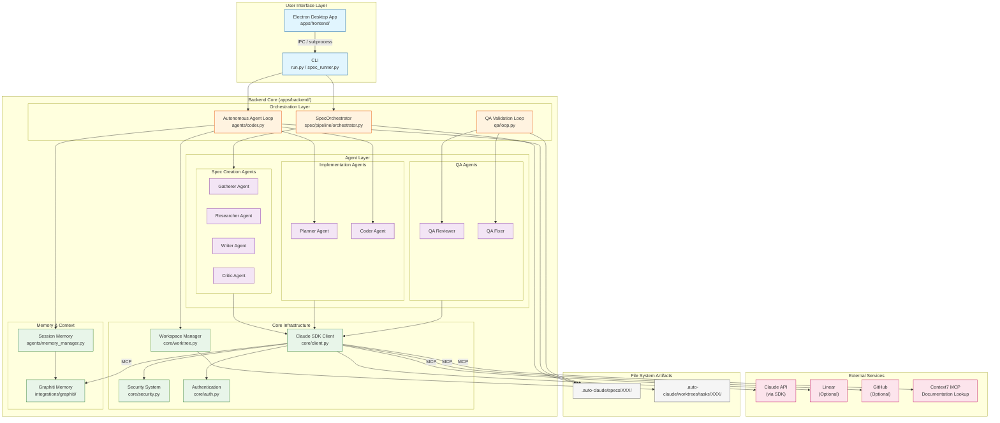
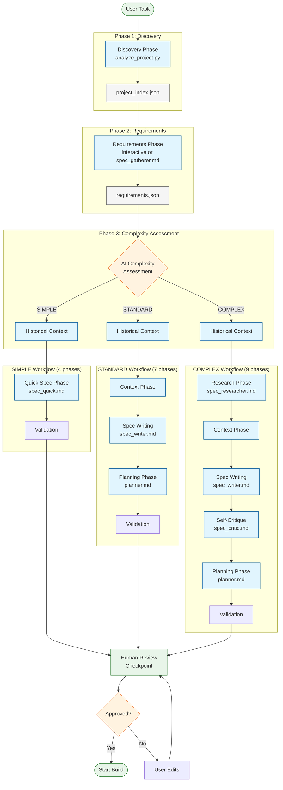

# Auto Claude Architecture Overview

This document provides a comprehensive technical overview of Auto Claude's architecture, including its agent system, pipelines, security model, and integrations.

> **Related Documentation:**
> - [CLAUDE.md](../CLAUDE.md) - Development guidance and quick reference
> - [CLI-USAGE.md](CLI-USAGE.md) - Terminal-only usage guide
> - [CONTRIBUTING.md](../CONTRIBUTING.md) - How to contribute

---

## Table of Contents

1. [Introduction](#introduction)
2. [System Overview](#system-overview)
3. [High-Level Architecture](#high-level-architecture)
4. [Spec Creation Pipeline](#spec-creation-pipeline)
5. [Implementation Pipeline](#implementation-pipeline)
6. [Agent System](#agent-system)
7. [Security Model](#security-model)
8. [Workspace Isolation](#workspace-isolation)
9. [Frontend-Backend Communication](#frontend-backend-communication)
10. [Integrations](#integrations)
11. [Data Flow and File Structure](#data-flow-and-file-structure)

---

## Introduction

Auto Claude is a **multi-agent autonomous coding framework** that builds software through coordinated AI agent sessions. Rather than using a single AI conversation to write code, Auto Claude orchestrates multiple specialized agents in a structured pipeline—from understanding requirements to writing code to validating the result.

### What Makes Auto Claude Different

Traditional AI coding assistants work in a single conversation where context accumulates and can be lost. Auto Claude takes a fundamentally different approach:

| Traditional AI Coding | Auto Claude |
|----------------------|-------------|
| Single conversation | Multi-session pipeline |
| Context accumulates | Fresh context per session |
| Manual task tracking | Automatic subtask management |
| No persistent memory | Cross-session memory via knowledge graph |
| Trust the output | Automated QA validation loop |
| Direct file changes | Isolated workspace (git worktrees) |

### Core Principles

1. **Structured Pipelines** - Tasks flow through well-defined phases: spec creation → planning → implementation → QA validation
2. **Fresh Context Windows** - Each agent session starts fresh, loading state from files rather than accumulating context
3. **Subtask-Based Work** - Large features are broken into atomic subtasks with individual verification
4. **Isolated Workspaces** - AI-generated code lives in git worktrees until explicitly merged by the user
5. **Defense in Depth** - Three-layer security model protects against unintended actions
6. **Cross-Session Memory** - Knowledge graph persists patterns, gotchas, and discoveries across sessions

### Primary Use Cases

- **Feature Development** - Transform a task description into implemented, tested code
- **Code Maintenance** - Handle bug fixes, refactoring, and code cleanup
- **GitHub Automation** - Automated PR reviews, issue triage, and auto-fixing
- **Documentation** - Generate and update documentation from code analysis

---

## System Overview

Auto Claude consists of two main components: a **Python backend** that orchestrates AI agents and manages the build process, and an optional **Electron desktop frontend** that provides a graphical interface for project management.

### Component Architecture

```
┌─────────────────────────────────────────────────────────────────────────┐
│                         Auto Claude System                              │
├─────────────────────────────────────────────────────────────────────────┤
│                                                                         │
│  ┌─────────────────────────────────┐    ┌─────────────────────────────┐ │
│  │       Electron Frontend         │    │       Python Backend        │ │
│  │  (Optional Desktop UI)          │    │   (Required - CLI/Agent)    │ │
│  │                                 │    │                             │ │
│  │  ┌───────────────────────────┐  │    │  ┌───────────────────────┐  │ │
│  │  │ React + TypeScript        │  │    │  │ Spec Creation         │  │ │
│  │  │ • Project Management      │  │    │  │ Pipeline              │  │ │
│  │  │ • Task Visualization      │  │◄──►│  │ (3-8 phases)          │  │ │
│  │  │ • Terminal Integration    │  │IPC │  └───────────────────────┘  │ │
│  │  └───────────────────────────┘  │    │                             │ │
│  │                                 │    │  ┌───────────────────────┐  │ │
│  │  ┌───────────────────────────┐  │    │  │ Implementation        │  │ │
│  │  │ Main Process (Node.js)    │  │    │  │ Pipeline              │  │ │
│  │  │ • Agent Process Manager   │  │───►│  │ (Planner→Coder→QA)    │  │ │
│  │  │ • PTY Terminal Manager    │  │    │  └───────────────────────┘  │ │
│  │  │ • IPC Handlers            │  │    │                             │ │
│  │  └───────────────────────────┘  │    │  ┌───────────────────────┐  │ │
│  │                                 │    │  │ Claude Agent SDK      │  │ │
│  └─────────────────────────────────┘    │  │ • Security Hooks      │  │ │
│                                         │  │ • MCP Servers         │  │ │
│                                         │  │ • Tool Permissions    │  │ │
│                                         │  └───────────────────────┘  │ │
│                                         │                             │ │
│                                         └─────────────────────────────┘ │
│                                                                         │
├─────────────────────────────────────────────────────────────────────────┤
│                           External Services                             │
│  ┌──────────────┐ ┌──────────────┐ ┌──────────────┐ ┌───────────────┐  │
│  │ Claude API   │ │ Graphiti     │ │ Linear       │ │ GitHub        │  │
│  │ (via SDK)    │ │ Memory       │ │ (optional)   │ │ (optional)    │  │
│  └──────────────┘ └──────────────┘ └──────────────┘ └───────────────┘  │
└─────────────────────────────────────────────────────────────────────────┘
```

### Backend Architecture (`apps/backend/`)

The Python backend is the core of Auto Claude. It can run standalone via CLI or be orchestrated by the Electron frontend.

| Directory | Purpose |
|-----------|---------|
| `core/` | Client factory, authentication, security, platform abstraction |
| `agents/` | Implementation agents (planner, coder, session management) |
| `qa/` | QA validation agents (reviewer, fixer, loop orchestration) |
| `spec/` | Spec creation pipeline (phases, orchestrator, discovery) |
| `spec_agents/` | Spec creation agents (gatherer, researcher, writer, critic) |
| `cli/` | Command-line interface and command handlers |
| `integrations/` | External service integrations (Graphiti, Linear, GitHub) |
| `prompts/` | Agent system prompts (markdown files) |
| `project/` | Project analysis for security profile generation |
| `security/` | Command validation and security hooks |

### Frontend Architecture (`apps/frontend/`)

The Electron desktop app provides a visual interface for managing projects and tasks.

| Directory | Purpose |
|-----------|---------|
| `src/main/` | Electron main process, IPC handlers, process managers |
| `src/renderer/` | React components, Zustand stores, hooks |
| `src/preload/` | Secure bridge between main and renderer processes |
| `src/shared/` | TypeScript types, i18n translations, constants |

### Key Technology Choices

| Component | Technology | Rationale |
|-----------|------------|-----------|
| AI Integration | Claude Agent SDK | Pre-configured security, MCP support, session management |
| Backend Runtime | Python 3.12+ | Rich AI/ML ecosystem, async support, cross-platform |
| Frontend Runtime | Electron + React | Desktop-class features, cross-platform, rich UI |
| State Management | Zustand (frontend) | Lightweight, TypeScript-first, no boilerplate |
| Memory System | Graphiti + LadybugDB | Knowledge graph for semantic search, no Docker required |
| Workspace Isolation | Git Worktrees | Native git feature, clean separation, easy cleanup |
| Process Communication | IPC (Electron) | Type-safe, bidirectional, secure context isolation |

### Operational Modes

Auto Claude can operate in several modes:

1. **CLI Mode** - Direct command-line usage without the desktop app
   ```bash
   python run.py --spec 001  # Run a spec
   python spec_runner.py --task "Add login feature"  # Create a spec
   ```

2. **Desktop Mode** - Full GUI experience via Electron
   ```bash
   npm start  # Launch desktop app
   ```

3. **GitHub Runner Mode** - Automated PR review and issue triage
   ```bash
   python run.py --pr 123 --review  # Review a PR
   python run.py --issue 456 --auto-fix  # Auto-fix an issue
   ```

### Data Flow Summary

```
User Task Description
        │
        ▼
┌───────────────────┐
│ Spec Creation     │ ──► requirements.json, context.json, spec.md
│ Pipeline          │
└───────────────────┘
        │
        ▼
┌───────────────────┐
│ Planner Agent     │ ──► implementation_plan.json
└───────────────────┘
        │
        ▼
┌───────────────────┐
│ Coder Agent       │ ──► Code changes in isolated worktree
│ (multiple sessions)│
└───────────────────┘
        │
        ▼
┌───────────────────┐
│ QA Validation     │ ──► qa_report.md, QA_FIX_REQUEST.md
│ Loop              │
└───────────────────┘
        │
        ▼
User Review & Merge
```

This overview sets the foundation for understanding the detailed architecture sections that follow. Each subsequent section dives deep into specific components, their interactions, and the design decisions behind them.

---

## High-Level Architecture

This section provides a detailed view of Auto Claude's architectural components and their relationships.

### System Component Diagram



### Component Responsibilities

#### Entry Points

| Entry Point | Location | Purpose |
|-------------|----------|---------|
| `run.py` | `apps/backend/run.py` | Bootstrap entry for CLI - validates Python version, configures encoding, delegates to `cli/main.py` |
| `spec_runner.py` | `apps/backend/spec_runner.py` | Interactive spec creation - can be invoked directly or chains to `run.py` |
| Electron Main | `apps/frontend/src/main/` | Desktop app entry - manages windows, spawns backend processes |

#### Orchestration Layer

The orchestration layer coordinates agent execution through well-defined pipelines:

| Orchestrator | Location | Role |
|--------------|----------|------|
| **SpecOrchestrator** | `spec/pipeline/orchestrator.py` | Drives spec creation through complexity-dependent phases (3-8 phases) |
| **Autonomous Agent Loop** | `agents/coder.py` | Executes Planner → Coder sessions iteratively until all subtasks complete |
| **QA Validation Loop** | `qa/loop.py` | Runs QA Reviewer → QA Fixer cycle until approval or escalation |

#### Agent Layer

Agents are the AI-powered workers that perform actual tasks. Each agent type has specific capabilities and tool access:

```
┌─────────────────────────────────────────────────────────────────┐
│                        SPEC CREATION AGENTS                      │
├────────────────┬───────────────────────────────────────────────-─┤
│ Gatherer       │ Collects user requirements, asks clarifying     │
│                │ questions, outputs requirements.json             │
├────────────────┼────────────────────────────────────────────────-┤
│ Researcher     │ Validates external integrations, checks API     │
│                │ compatibility, outputs research.json             │
├────────────────┼────────────────────────────────────────────────-┤
│ Writer         │ Creates spec.md from requirements and context   │
├────────────────┼────────────────────────────────────────────────-┤
│ Critic         │ Self-critique using extended thinking,          │
│                │ improves spec quality                            │
└────────────────┴────────────────────────────────────────────────-┘

┌─────────────────────────────────────────────────────────────────┐
│                      IMPLEMENTATION AGENTS                       │
├────────────────┬────────────────────────────────────────────────-┤
│ Planner        │ Analyzes spec, creates implementation_plan.json │
│                │ with subtasks, verification strategies          │
├────────────────┼────────────────────────────────────────────────-┤
│ Coder          │ Implements subtasks one-by-one, commits code,   │
│                │ updates plan status                              │
└────────────────┴────────────────────────────────────────────────-┘

┌─────────────────────────────────────────────────────────────────┐
│                          QA AGENTS                               │
├────────────────┬────────────────────────────────────────────────-┤
│ QA Reviewer    │ Validates implementation against acceptance     │
│                │ criteria, runs tests, checks security           │
├────────────────┼────────────────────────────────────────────────-┤
│ QA Fixer       │ Fixes issues identified by reviewer, minimal    │
│                │ changes approach                                 │
└────────────────┴────────────────────────────────────────────────-┘
```

#### Core Infrastructure

The core layer provides foundational services used by all agents:

| Component | Location | Responsibility |
|-----------|----------|----------------|
| **Claude SDK Client** | `core/client.py` | Factory for configured `ClaudeSDKClient` with security hooks, MCP servers, and tool permissions |
| **Authentication** | `core/auth.py` | OAuth token resolution from env vars, keychains; SDK environment passthrough |
| **Security System** | `core/security.py` + `security/` | Three-layer defense: sandbox, filesystem permissions, command allowlist |
| **Project Analyzer** | `project/analyzer.py` | Detects tech stack, generates dynamic command allowlist |
| **Workspace Manager** | `core/worktree.py` | Git worktree lifecycle: create, sync, merge, cleanup |

#### Memory System

Memory enables cross-session learning and context persistence:

| Component | Location | Function |
|-----------|----------|----------|
| **Graphiti Memory** | `integrations/graphiti/` | Knowledge graph with semantic search, stores patterns/gotchas/discoveries |
| **Session Memory** | `agents/memory_manager.py` | Orchestrates memory retrieval at session start, saves insights at session end |
| **File-Based Fallback** | `session_memory.json` | Lightweight JSON fallback when Graphiti is unavailable |

### Layered Architecture View

Auto Claude follows a layered architecture where each layer has clear responsibilities and dependencies flow downward:

```
┌─────────────────────────────────────────────────────────────────────┐
│ PRESENTATION LAYER                                                   │
│   CLI (argparse) │ Electron IPC │ Web API (future)                  │
├─────────────────────────────────────────────────────────────────────┤
│ ORCHESTRATION LAYER                                                  │
│   SpecOrchestrator │ AutonomousAgentLoop │ QAValidationLoop         │
├─────────────────────────────────────────────────────────────────────┤
│ AGENT LAYER                                                          │
│   Spec Agents │ Implementation Agents │ QA Agents                   │
│   (Each agent = system prompt + tool permissions + MCP access)      │
├─────────────────────────────────────────────────────────────────────┤
│ CORE SERVICES LAYER                                                  │
│   ClaudeSDKClient │ SecurityProfile │ WorktreeManager │ Memory      │
├─────────────────────────────────────────────────────────────────────┤
│ INFRASTRUCTURE LAYER                                                 │
│   Claude API │ Git │ File System │ External APIs (Linear, GitHub)  │
└─────────────────────────────────────────────────────────────────────┘
```

### Key Architectural Patterns

#### 1. Fresh Context Window Pattern

Each agent session starts with a fresh context window. State is loaded from files (spec, plan, previous outputs) rather than accumulated from conversation history:

```python
# agents/coder.py - Each session loads state fresh
def run_autonomous_agent():
    # Load plan from file (not from memory)
    plan = load_implementation_plan(spec_dir)

    # Find next subtask to work on
    subtask = get_next_pending_subtask(plan)

    # Generate prompt with all needed context
    prompt = generate_subtask_prompt(subtask, spec_dir)

    # Run session with fresh context
    client.create_agent_session(starting_message=prompt)
```

**Why?** AI context windows have limits. Long conversations degrade performance. Fresh sessions maintain quality.

#### 2. Subtask-Based Execution

Large features are decomposed into atomic subtasks, each with:
- Clear description
- Files to modify
- Verification strategy
- Status tracking (pending → in_progress → completed)

```json
{
  "id": "subtask-2-1",
  "description": "Add authentication middleware",
  "files": ["src/middleware/auth.ts"],
  "verification": "npm test -- auth.test.ts",
  "status": "pending"
}
```

**Why?** Atomic units are easier for AI to implement correctly. Failed subtasks can be retried without losing progress.

#### 3. Phase-Aware Tool Configuration

Different agents get different tool access based on their role:

| Agent Type | Tools | MCP Servers |
|------------|-------|-------------|
| Spec Gatherer | Read + Web | — |
| Spec Researcher | Read + Web | context7 |
| Planner | Read + Write + Web | context7, graphiti, auto-claude |
| Coder | Read + Write + Web | context7, graphiti, auto-claude |
| QA Reviewer | Read + Write + Web | context7, graphiti, auto-claude, browser |
| QA Fixer | Read + Write + Web | context7, graphiti, auto-claude, browser |

**Why?** Least privilege principle. Spec gathering agents don't need write access. Only QA agents need browser automation.

#### 4. Isolation-First Workspace

By default, all AI-generated code is written to an isolated git worktree:

```
project/
├── .auto-claude/
│   ├── specs/001-feature/       # Spec artifacts
│   └── worktrees/tasks/001-feature/  # Isolated workspace (git worktree)
├── src/                         # User's code (untouched)
└── ...
```

**Why?** Users can review, test, and reject AI changes without affecting their working directory.

#### 5. Recovery and Resilience

The system includes multiple recovery mechanisms:

| Mechanism | Purpose |
|-----------|---------|
| **RecoveryManager** | Tracks failed subtask attempts, provides hints, marks stuck tasks |
| **Consecutive Error Escalation** | After 3 consecutive errors in QA loop, escalates to human |
| **Recurring Issue Detection** | After 3 occurrences of same issue, escalates to human |
| **Human Intervention File** | `PAUSE` file in spec dir halts automation for manual intervention |

### Request Flow Example

Here's how a typical feature request flows through the architecture:

```
1. User: "Add user authentication with JWT"
                    │
                    ▼
2. CLI parses command, invokes SpecOrchestrator
                    │
                    ▼
3. SpecOrchestrator runs complexity assessment
   └── Determines: STANDARD complexity (6 phases)
                    │
                    ▼
4. Spec Creation Pipeline:
   ├── Discovery Phase → project_index.json
   ├── Requirements Phase → requirements.json (via Gatherer Agent)
   ├── Context Phase → context.json
   ├── Spec Writing Phase → spec.md (via Writer Agent)
   └── Planning Phase → implementation_plan.json (via Planner Agent)
                    │
                    ▼
5. Autonomous Agent Loop starts:
   └── For each subtask:
       ├── Load subtask context
       ├── Retrieve Graphiti memory
       ├── Run Coder Agent session
       ├── Post-session: commit, update plan, save memory
       └── Continue to next subtask
                    │
                    ▼
6. QA Validation Loop:
   ├── Run QA Reviewer
   ├── If rejected: Run QA Fixer → Loop back
   └── If approved: Complete
                    │
                    ▼
7. User Review:
   ├── Test in isolated worktree
   ├── Approve → Merge to main
   └── Reject → Discard worktree
```

---

## Spec Creation Pipeline

The Spec Creation Pipeline transforms a user's task description into a comprehensive specification document with an implementation plan. It dynamically adapts its workflow based on task complexity—simple tasks flow through a streamlined 4-phase pipeline while complex tasks go through up to 9 phases including research and self-critique.

### Pipeline Overview

The pipeline is orchestrated by the `SpecOrchestrator` class (`spec/pipeline/orchestrator.py`), which:

1. **Assesses Complexity** - Uses AI or heuristics to determine task scope
2. **Selects Phases** - Chooses which phases to run based on complexity
3. **Executes Phases** - Runs phases sequentially with retry logic
4. **Compacts Context** - Summarizes completed phases to manage context window
5. **Validates Output** - Ensures all required artifacts are created

### Complexity Tiers

Auto Claude uses three complexity tiers to optimize the spec creation process:

| Tier | Files | Services | Integrations | Example Tasks |
|------|-------|----------|--------------|---------------|
| **SIMPLE** | 1-2 | 1 | None | Fix typo, update button text, change colors |
| **STANDARD** | 3-10 | 1-2 | 0-1 | Add a feature, create new component, refactor module |
| **COMPLEX** | 10+ | 3+ | 2+ | Add authentication, integrate payment system, multi-service refactor |

#### Complexity Assessment

Complexity can be determined three ways:

1. **AI Assessment** (default) - Runs `complexity_assessor.md` prompt to analyze requirements
2. **Heuristic Analysis** - Keyword matching and pattern detection (fallback)
3. **Manual Override** - User specifies `--complexity simple/standard/complex`

```python
# spec/complexity.py - ComplexityAnalyzer keywords
SIMPLE_KEYWORDS = ["fix", "typo", "update", "change", "rename", "style", "color", "text"]
COMPLEX_KEYWORDS = ["integrate", "api", "database", "migrate", "authentication", "oauth"]
```

### Phase Definitions

Each complexity tier runs a different set of phases:

```
SIMPLE (4 phases):
  discovery → historical_context → quick_spec → validation

STANDARD (7 phases):
  discovery → requirements → historical_context → [research] → context → spec_writing → planning → validation

COMPLEX (9 phases):
  discovery → requirements → historical_context → research → context → spec_writing → self_critique → planning → validation
```

#### Phase Details

| Phase | Agent/Script | Output File | Purpose |
|-------|--------------|-------------|---------|
| **discovery** | `analyze_project()` | `project_index.json` | Scan project structure, detect tech stack, identify capabilities |
| **requirements** | Interactive / `spec_gatherer.md` | `requirements.json` | Collect task description, acceptance criteria, constraints |
| **complexity_assessment** | `complexity_assessor.md` | `complexity_assessment.json` | Analyze task scope, determine phases to run |
| **historical_context** | Graphiti query | `graph_hints.json` | Retrieve relevant patterns and gotchas from past sessions |
| **research** | `spec_researcher.md` | `research.json` | Validate external integrations, check API compatibility |
| **context** | File analysis | `context.json` | Identify relevant files, existing patterns, dependencies |
| **spec_writing** | `spec_writer.md` | `spec.md` | Create detailed feature specification document |
| **self_critique** | `spec_critic.md` | Updates `spec.md` | Review and improve spec using extended thinking |
| **quick_spec** | `spec_quick.md` | `spec.md` + `implementation_plan.json` | Combined spec+plan for simple tasks |
| **planning** | `planner.md` | `implementation_plan.json` | Create subtask-based implementation plan |
| **validation** | `SpecValidator` | — | Verify all required files exist with valid structure |

### Spec Creation Flow Diagram



### Spec Creation Agents

The pipeline uses specialized agents for different phases:

#### Gatherer Agent (`spec_gatherer.md`)

**Purpose:** Interactively collects requirements from the user.

**Capabilities:**
- Asks clarifying questions about scope
- Identifies services and components involved
- Extracts acceptance criteria
- Detects constraints and blockers

**Output:** `requirements.json` with structured task information

#### Researcher Agent (`spec_researcher.md`)

**Purpose:** Validates external integrations and researches best practices.

**Capabilities:**
- Verifies package names and versions
- Checks API compatibility
- Identifies known issues or gotchas
- Uses Context7 MCP for documentation lookup

**Output:** `research.json` with validated integration details

#### Writer Agent (`spec_writer.md`)

**Purpose:** Creates the comprehensive specification document.

**Capabilities:**
- Synthesizes requirements, research, and context
- Defines technical approach
- Documents API contracts
- Lists all files to modify

**Output:** `spec.md` with complete feature specification

#### Critic Agent (`spec_critic.md`)

**Purpose:** Self-reviews the spec using extended thinking (ultrathink mode).

**Capabilities:**
- Identifies gaps and inconsistencies
- Suggests improvements to technical approach
- Validates acceptance criteria completeness
- Ensures implementation feasibility

**Output:** Updated `spec.md` with improvements

#### Quick Spec Agent (`spec_quick.md`)

**Purpose:** Combined spec and plan creation for simple tasks.

**Capabilities:**
- Creates streamlined spec for small changes
- Generates implementation plan simultaneously
- Skips unnecessary phases for efficiency

**Output:** `spec.md` + `implementation_plan.json`

### Phase Execution Architecture

The `PhaseExecutor` class (`spec/phases/executor.py`) combines multiple mixins to implement all phases:

```
PhaseExecutor
├── DiscoveryPhaseMixin      # phase_discovery, phase_context
├── RequirementsPhaseMixin   # phase_requirements, phase_historical_context, phase_research
├── SpecPhaseMixin           # phase_spec_writing, phase_self_critique, phase_quick_spec
└── PlanningPhaseMixin       # phase_planning, phase_validation
```

Each phase:
1. **Checks for existing output** - Idempotency (skip if file exists)
2. **Runs agent/script** - Up to 3 retry attempts
3. **Validates output** - Ensures file was created with valid structure
4. **Stores summary** - Compacts output for subsequent phases (context window management)

### Phase Compaction

To manage context window size, completed phases are summarized:

```python
# spec/compaction.py
async def summarize_phase_output(phase_name: str, output: str, target_words: int = 500) -> str:
    """Summarize phase output to fit in context window."""
    # Uses a small, fast model to create concise summaries
    # Summaries are passed to subsequent phases as prior_phase_summaries
```

This allows the full pipeline to run without exhausting the context window, even for complex tasks with lengthy outputs.

### Output Files Summary

After spec creation completes, the spec directory contains:

```
.auto-claude/specs/001-add-auth/
├── requirements.json          # User requirements and acceptance criteria
├── complexity_assessment.json # Complexity tier and reasoning
├── graph_hints.json          # Historical context from Graphiti (if enabled)
├── research.json             # External integration research (if needed)
├── context.json              # Relevant files and patterns
├── spec.md                   # Complete feature specification
└── implementation_plan.json  # Subtask-based plan (ready for build)
```

### Human Review Checkpoint

After all phases complete, the pipeline pauses for human review:

1. **Display Summary** - Shows complexity, phases run, files created
2. **Review Options** - User can approve, edit spec, or abort
3. **Validation** - Checks that all required files exist
4. **Approval Required** - Build cannot proceed without explicit approval

This checkpoint ensures the AI's understanding matches user intent before committing significant resources to implementation.

---

<!-- Subsequent sections will be added in following subtasks -->
